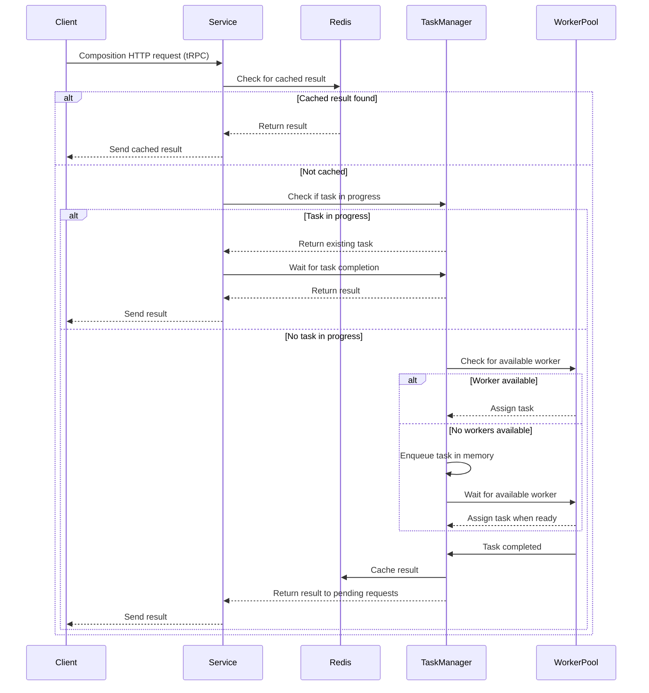

# `@hive/schema`

Service for validating schemas or verifying whether a composite GraphQL schema can be composed out
of subschemas. Supports Federation, Schema Stitching and Monolithic Schemas.

## Configuration

| Name                                | Required | Description                                                                                              | Example Value                                        |
| ----------------------------------- | -------- | -------------------------------------------------------------------------------------------------------- | ---------------------------------------------------- |
| `PORT`                              | **Yes**  | The port on which this service runs.                                                                     | `6250`                                               |
| `REDIS_HOST`                        | **Yes**  | The host of your redis instance.                                                                         | `"127.0.0.1"`                                        |
| `REDIS_PORT`                        | **Yes**  | The port of your redis instance.                                                                         | `6379`                                               |
| `REDIS_PASSWORD`                    | **Yes**  | The password of your redis instance.                                                                     | `"apollorocks"`                                      |
| `REDIS_TLS_ENABLED`                 | **No**   | Enable TLS for redis connection (rediss://).                                                             | `"0"`                                                |
| `ENCRYPTION_SECRET`                 | **Yes**  | Secret for encrypting stuff.                                                                             | `8ebe95cg21c1fee355e9fa32c8c33141`                   |
| `ENVIRONMENT`                       | No       | The environment of your Hive app. (**Note:** This will be used for Sentry reporting.)                    | `staging`                                            |
| `BODY_LIMIT`                        | No       | Maximum payload size in bytes. Defaults to 11 MB.                                                        | `11000000`                                           |
| `SENTRY`                            | No       | Whether Sentry error reporting should be enabled.                                                        | `1` (enabled) or `0` (disabled)                      |
| `SENTRY_DSN`                        | No       | The DSN for reporting errors to Sentry.                                                                  | `https://dooobars@o557896.ingest.sentry.io/12121212` |
| `PROMETHEUS_METRICS`                | No       | Whether Prometheus metrics should be enabled                                                             | `1` (enabled) or `0` (disabled)                      |
| `PROMETHEUS_METRICS_LABEL_INSTANCE` | No       | The instance label added for the prometheus metrics.                                                     | `schema`                                             |
| `PROMETHEUS_METRICS_PORT`           | No       | Port on which prometheus metrics are exposed                                                             | Defaults to `10254`                                  |
| `REQUEST_BROKER`                    | No       | Whether Request Broker should be enabled.                                                                | `1` (enabled) or `0` (disabled)                      |
| `REQUEST_BROKER_ENDPOINT`           | No       | The address                                                                                              | `https://broker.worker.dev`                          |
| `REQUEST_BROKER_SIGNATURE`          | No       | A secret signature needed to verify the request origin                                                   | `hbsahdbzxch123`                                     |
| `REQUEST_LOGGING`                   | No       | Log http requests                                                                                        | `1` (enabled) or `0` (disabled)                      |
| `LOG_LEVEL`                         | No       | The verbosity of the service logs. One of `trace`, `debug`, `info`, `warn` ,`error`, `fatal` or `silent` | `info` (default)                                     |
| `OPENTELEMETRY_COLLECTOR_ENDPOINT`  | No       | OpenTelemetry Collector endpoint. The expected traces transport is HTTP (port `4318`).                   | `http://localhost:4318/v1/traces`                    |

## Documentation

### Composition Request Handling

The following diagram outlines how the service handles incoming composition requests via HTTP
(tRPC). It details the decision-making process around caching with Redis, reuse of in-progress
tasks, and task execution using a limited pool of worker threads.

Each composition task runs in an isolated worker thread with memory limits to prevent a single
malfunctioning task from affecting the stability of the entire service. This setup ensures robust
and efficient processing by avoiding redundant computation, serving cached results when possible,
and queuing tasks when resources are saturated.

