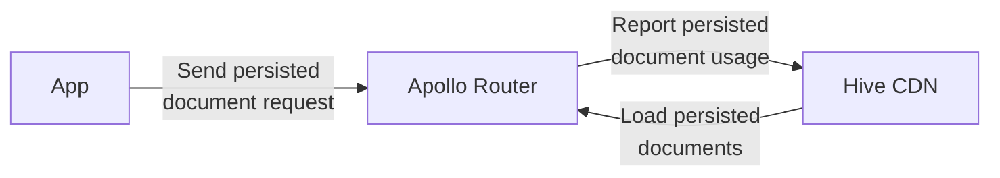

import NextImage from 'next/image'

We're excited to announce that the [**App Deployments**](/docs/other-integrations/apollo-router)
feature is now available for Apollo Router!

## App Deployments / Persisted Documents

App Deployments (persisted documents) are a way to group and publish your GraphQL operations as a
single app version to the Hive Registry. This allows you to keep track of your different app
versions, their operations usage, and performance.

import pendingAppImage from '../../../../../public/docs/pages/features/app-deployments/pending-app.png'

<NextImage
  alt="Pending App Deployment"
  src={pendingAppImage}
  className="mt-10 max-w-2xl rounded-lg drop-shadow-md"
/>

## How to use App Deployments with Apollo Router



To use App Deployments with Apollo Router, follow the
[installation instructions](/docs/other-integrations/apollo-router), and use the latest image
version (`router1.58.0-plugin1.1.0`) of the
[custom build of Apollo Router](/docs/other-integrations/apollo-router).

Push your GraphQL operations to the App Deployments store, and then configure Apollo-Router with the
`hive.persisted_documents` plugin:

```yaml filename="router.yaml"
# ... the rest of your configuration
plugins:
  hive.usage: {}
  hive.persisted_documents:
    enabled: true
```

To learn more about App Deployments and how to use them with Apollo Router, check out the following
resources:

- [Hive custom build of Apollo-Router](/docs/other-integrations/apollo-router#app-deployments-persisted-documents)
- [App Deployments documentation](/docs/schema-registry/app-deployments)
