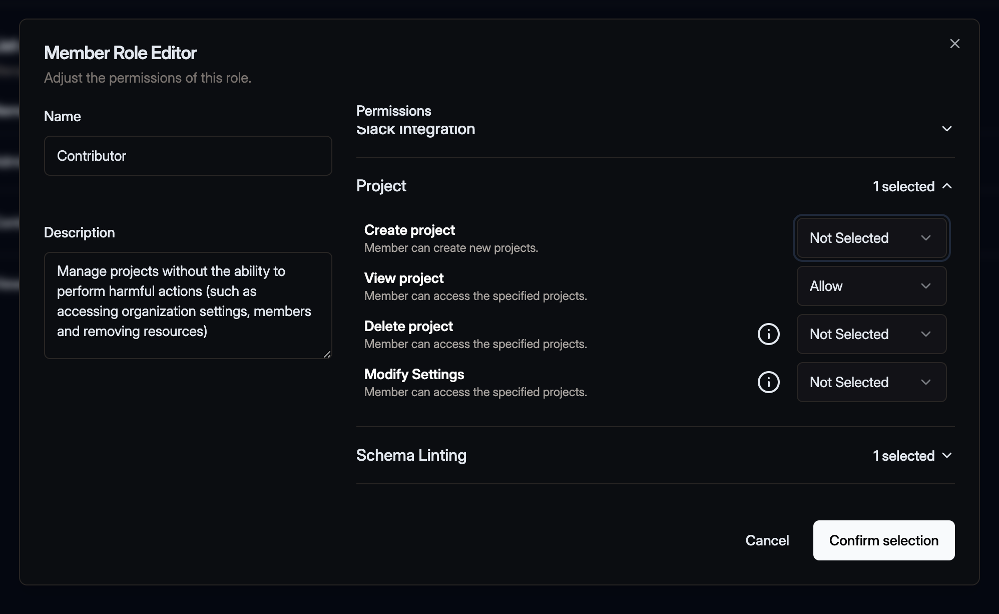
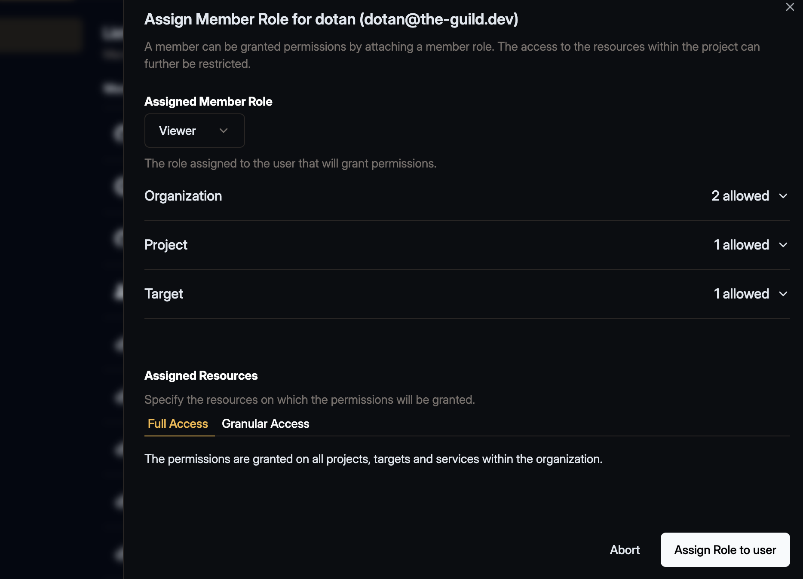

We’ve enhanced the Permissions System, introducing more granular control, including role-based
access control (RBAC) at the project and service level.

## What’s New?

- **Flexible Role Permissions** – Assign fine-tuned permissions to organization members based on
  their roles.
- **Granular Resource Access** – Grant read access to projects without allowing users to create new
  targets or approve failed schema checks in certain services.

## Important Changes

For security reasons, the following updates apply to existing members and roles:

- **Viewer Role Adjustments** – Members with the default Viewer role will lose the ability to create
  targets or projects.
- **Restricted Role Management** – Permissions for inviting, removing, or assigning roles have been
  revoked. An admin must reassign these permissions as needed.
- **Expanded Role Assignment Capabilities** – Members with permissions to manage invites, remove
  members, or modify roles can now grant additional permissions without restrictions. Use caution
  when assigning these rights, as we recommend reserving them for "Admin" roles.

[Learn more in the updated documentation](/docs/management/members-roles-permissions)
