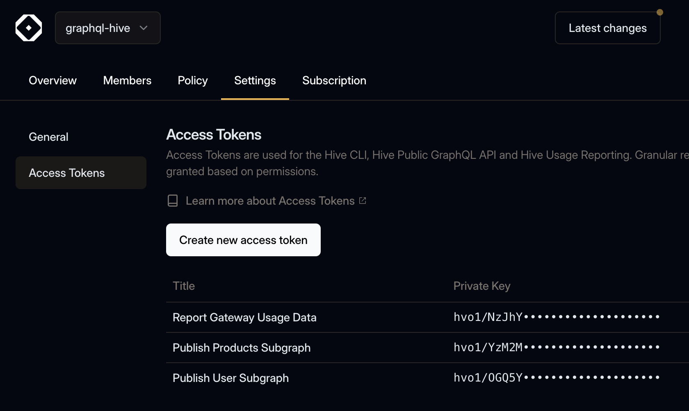

After introducing role-based access control (RBAC) at the project and service level for member
roles, we are excited to introduce several enhancements to **GraphQL Hive** that improve **security,
usability, and schema management**.

**TL;DR:** Follow our
[migration guide for migrating from registry access tokens to access tokens](/docs/migration-guides/organization-access-tokens).

## Access Tokens on Organization Level

We’ve introduced **organization access tokens** to enhance security and simplify access management
across teams.

**Key benefits:**

- **Granular permission scopes:** Define precise permissions for tokens, restricting their access to
  specific resources (e.g., projects, targets, services, or app deployments).
- **Principle of least privilege:** Ensure tokens only have the permissions they need—nothing more
- **Replacement for registry access tokens:** These new access tokens will fully replace registry
  access tokens used for the Hive CLI and usage reporting.
- **Foundation for the upcoming GraphQL Management API:** These tokens will enable programmatic
  interaction with Hive Console, allowing for resource creation (e.g., projects, targets, subgraph
  publishing).

[Learn more in the Access Token documentation](/docs/management/access-tokens)

## Deprecation of Registry Access Tokens

Registry access tokens will be **deprecated** in favor of the new access tokens. While no official
deprecation date has been set, we strongly encourage teams to migrate now to take advantage of
improved flexibility and security.

## Migration Guide

To ease the transition, we’ve prepared a step-by-step migration guide for the Hive CLI, Hive
Gateway, Hive SDKs, Apollo Router, and more integrations.

[Check out the access token migration guide](/docs/migration-guides/organization-access-tokens).
