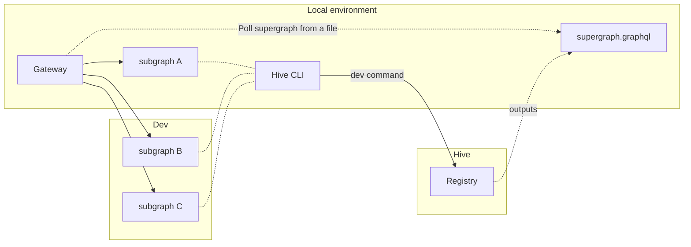

import { Callout, Tabs } from '@theguild/components'

# Hive CLI (Command Line Interface)

You can perform [schema-registry actions](/docs/schema-registry#actions-on-schemas) on your Hive
targets schemas using the Hive CLI.

## Installation

You can install the Hive CLI as a binary, docker container or a npm package for Node.js.

<Tabs items={['Binary', 'Docker', 'Node.js' ]}>

{/* Binary */}

<Tabs.Tab>

Download the prebuilt binary of Hive CLI using the following command:

<Tabs items={['MacOS / Linux', 'Windows']}>
  <Tabs.Tab>
    ```sh
    curl -sSL https://graphql-hive.com/install.sh | sh
    ```
  </Tabs.Tab>

  <Tabs.Tab>
    ```sh
    powershell -c "irm https://graphql-hive.com/install.ps1 | iex"
    ```
  </Tabs.Tab>
</Tabs>

</Tabs.Tab>

{/* Docker */}

<Tabs.Tab>

We publish a docker image for the CLI to the GitHub container registry.

```sh
docker pull ghcr.io/graphql-hive/cli
```

</Tabs.Tab>

{/* Node.js */}

<Tabs.Tab>

If you are running a JavaScript/Node.js project, you can install Hive CLI from the `npm`.

<Callout type="info">
  We recommend installing Hive CLI as part of your project as `devDependencies`, instead of using a
  global installation.
</Callout>

```sh npm2yarn
npm i -D @graphql-hive/cli
```

</Tabs.Tab>

</Tabs>

### Specific Version

You can also use a specific version of the CLI. A list of all available versions is available on the
[GitHub releases page](https://github.com/graphql-hive/console/releases?q=%22%40graphql-hive%2Fcli%22&expanded=true).

<Tabs items={['Binary', 'Docker', 'Node.js']}>

{/* Binary */}

<Tabs.Tab>

<Tabs items={['MacOS / Linux', 'Windows']}>
  <Tabs.Tab>
    ```sh
    curl -sSL https://graphql-hive.com/install.sh | sh -s "0.50.1"
    # or
    curl -sSL https://graphql-hive.com/install.sh | HIVE_CLI_VERSION="0.50.1" sh
    # or
    export HIVE_CLI_VERSION="0.50.1"
    curl -sSL https://graphql-hive.com/install.sh | sh
    ```
  </Tabs.Tab>

  <Tabs.Tab>
    ```sh
    $env:HIVE_CLI_VERSION="0.50.1"; powershell -c "irm https://graphql-hive.com/install.ps1 | iex"
    ```
  </Tabs.Tab>
</Tabs>

</Tabs.Tab>

{/* Docker */}

<Tabs.Tab>

```sh
export HIVE_CLI_VERSION="0.50.1"
docker pull "ghcr.io/graphql-hive/cli:$HIVE_CLI_VERSION"
```

</Tabs.Tab>

{/* Node.js */}

<Tabs.Tab>

```sh npm2yarn
npm i -D @graphql-hive/cli@0.50.1
```

</Tabs.Tab>

</Tabs>

## Basics

### Git Integration

If you are running `hive` command line in a directory that has a Git repository configured (`.git`),
the CLI willl automatically extract the values for the author and commit for the certain commands
(e.g. schema publish and schema check.

You may override these values by excplicitly passing the `--author` and `--commit` flags to the CLI.

If your project does not have a Git repository configured with a user name and email, you are
required to pass the `--author` and `--commit` flags to the CLI.

If you need to change the way Git identifies your `author` property, you may use the following
commands:

```bash
git config --global user.name "John Doe"
git config --global user.email "john@doe.org"
```

## Usage

### Publish a Schema

You can use the CLI for publishing schema or services/subgraphs to the schema registry.

<Callout type="info" emoji="🔑">
  This CLI command requires a access token with the `Schema publish` permissions on the specified
  target. Please refer to our access token [documentation for creating an access
  token](/docs/management/access-tokens).
</Callout>

<Callout>
  We recommend publishing the schema from your CI/CD pipeline. You can find more information in out
  [CI/CD Integration guide](/docs/other-integrations/ci-cd).
</Callout>

<Tabs items={['Apollo Federation / Schema Stitching', 'Monolithic Schema']}>

<Tabs.Tab>

```bash
hive schema:publish \
  --registry.accessToken "<YOUR_ACCESS_TOKEN>" \
  --target "<YOUR_ORGANIZATION>/<YOUR_PROJECT>/<YOUR_TARGET>" \
  --service reviews \
  --url http://my-service.com/graphql \
  schema.graphql
```

**Further reading:**

- [Publishing a schema to the Schema Registry](/docs/schema-registry#publish-a-schema)
- [`schema:publish` API Reference](https://github.com/graphql-hive/console/blob/main/packages/libraries/cli/README.md#hive-apppublish)
- [Apollo Router integration](/docs/other-integrations/apollo-router)
- [Apollo-Server integration](/docs/other-integrations/apollo-server)

</Tabs.Tab>

<Tabs.Tab>

If you have a single file for your GraphQL schema:

```bash
hive schema:publish \
  --registry.accessToken "<YOUR_ACCESS_TOKEN>" \
  --target "<YOUR_ORGANIZATION>/<YOUR_PROJECT>/<YOUR_TARGET>" \
  schema.graphql
```

Or, multiple files using a `glob` expression:

```bash
hive schema:publish \
  --registry.accessToken "<YOUR_ACCESS_TOKEN>" \
  --target "<YOUR_ORGANIZATION>/<YOUR_PROJECT>/<YOUR_TARGET>" \
  "src/*.graphql"
```

**Further reading:**

- [Publishing a schema to the Schema Registry](/docs/schema-registry#publish-a-schema)
- [`schema:publish` API Reference](https://github.com/graphql-hive/console/blob/main/packages/libraries/cli/README.md#hive-apppublish)

</Tabs.Tab>

</Tabs>

#### GitHub Integration

If GitHub Integration is enabled for your organization, and the GitHub integration has access to the
GitHub repository, you may specify an additional `--github` flag to report the results back to
GitHub as Check Suite when running the Hive CLI from within a GitHub action.

<Callout>
  Check our [CI/CD Integration guide](/docs/other-integrations/ci-cd) for more information and
  GitHub workflow examples.
</Callout>

```sh
hive schema:publish \
  --registry.accessToken "<YOUR_ACCESS_TOKEN>" \
  --target "<YOUR_ORGANIZATION>/<YOUR_PROJECT>/<YOUR_TARGET>" \
  schema.graphql \
  --github
```

**Further reading:**

- [Publishing a schema to the Schema Registry](/docs/schema-registry#publish-a-schema)
- [`schema:publish` API Reference](https://github.com/graphql-hive/console/blob/main/packages/libraries/cli/README.md#hive-apppublish)

#### Metadata

<Callout>
  For most cases, it's recommended to add metadata directly to your schema with the [@meta Link
  Specification](/docs/specs/link-specifications#meta) instead of using `--metadata`. Directives
  allow you to enhance specific parts of your schema with this important information, which can be
  especially useful for large projects with multiple owners.
</Callout>

You can attach metadata to your schema publication. Metadata files published to Hive must be valid
JSON and are limited to `25MB`. This metadata is not exposed in the Hive UI, but it can be useful
for storing JSON configuration files for services, such as for
[GraphQL Mesh](https://the-guild.dev/graphql/mesh/docs/config-reference).

To attach metadata to your published schema, you can use `--metadata` flag when publishing.

You can load the metadata from a file:

```bash
hive schema:publish \
  --registry.accessToken "<YOUR_ACCESS_TOKEN>" \
  --target "<YOUR_ORGANIZATION>/<YOUR_PROJECT>/<YOUR_TARGET>" \
  schema.graphql \
  --metadata metadata.json
```

Or, use an inline JSON passed as a string:

```bash
hive schema:publish \
  --registry.accessToken "<YOUR_ACCESS_TOKEN>" \
  --target "<YOUR_ORGANIZATION>/<YOUR_PROJECT>/<YOUR_TARGET>" \
  schema.graphql \
  --metadata '{ "someData": true }'
```

**Further reading:**

- [Fetching Hive Metadata from the CDN](/docs/high-availability-cdn)
- [Using the @meta Link Specification](/docs/specs/link-specifications#meta)

### Check a Schema

<Callout type="info" emoji="🔑">
  This CLI command requires a access token with the `Schema Check` permissions on the specified
  target. Please refer to our access token [documentation for creating an access
  token](/docs/management/access-tokens).
</Callout>

Checking a GraphQL schema is the form of checking the compatbility of an upcoming schema, compared
to the latest published version.

This process of checking a schema needs to be done before **publishing** a new schema version. This
is usually done as part of a CI/CD pipeline, and as part of Pull Request flow.

Hive CLI will give you a list of all changes, sorted by criticality level (Breaking, Dangerous,
Safe) and fail the check once breaking change is detected.

```bash
hive schema:check \
  --registry.accessToken "<YOUR_ACCESS_TOKEN>" \
  --target "<YOUR_ORGANIZATION>/<YOUR_PROJECT>/<YOUR_TARGET>" \
  schema.graphql
```

Or, multiple files using a `glob` expression:

```bash
hive schema:check \
  --registry.accessToken "<YOUR_ACCESS_TOKEN>" \
  --target "<YOUR_ORGANIZATION>/<YOUR_PROJECT>/<YOUR_TARGET>" \
  "src/*.graphql"
```

If you want to be able to leverage breaking change approvals, you must provide the `--contextId`
parameter. Using `--contextId` is optional when using GitHub repositories and actions with the
`--github` flag.

```bash
hive schema:check \
  --registry.accessToken "<YOUR_ACCESS_TOKEN>" \
  --target "<YOUR_ORGANIZATION>/<YOUR_PROJECT>/<YOUR_TARGET>" \
  --contextId "pr-123" "src/*.graphql"
```

For distributed schemas (Federated or Stitching), you are able to view changes to subgraph URLs by
providing the `--url` parameter.

```bash
hive schema:check "src/schema.graphql" --service users --url "https://users.graphql-hive.com/graphql"
```

**Further reading:**

- [Checking a schema with the Schema Registry](/docs/schema-registry#check-a-schema)
- [Conditional Breaking Changes](/docs/management/targets#conditional-breaking-changes)
- [Approving breaking schema changes](/docs/schema-registry#approve-breaking-schema-changes)

#### GitHub Integration

If GitHub Integration is enabled for your organization, and the GitHub integration has access to the
GitHub repository, you may specify an additional `--github` flag to report the results back to
GitHub as Check Suite when running the Hive CLI from within a GitHub action.

<Callout>
  Check our [CI/CD Integration guide](/docs/other-integrations/ci-cd) for more information and
  GitHub workflow examples.
</Callout>

```sh
hive schema:check \
  --registry.accessToken "<YOUR_ACCESS_TOKEN>" \
  --target "<YOUR_ORGANIZATION>/<YOUR_PROJECT>/<YOUR_TARGET>" \
  schema.graphql \
  --github
```

### Delete a Subgraph

<Callout type="info">
  This action is only available for Schema-Stitching and Apollo Federation projects.
</Callout>

<Callout type="info" emoji="🔑">
  This CLI command requires a access token with the `Delete subgraph` permissions on the specified
  target. Please refer to our [documentation for creating access
  tokens](/docs/management/access-tokens).
</Callout>

In case you want to compose a schema (or a subgraph in case of Federation), you can do so by using
the `hive schema:delete` command.

```bash
hive schema:delete \
  --registry.accessToken "<YOUR_ACCESS_TOKEN>" \
  --target "<YOUR_ORGANIZATION>/<YOUR_PROJECT>/<YOUR_TARGET>" \
  "<SERVICE_NAME>"
```

**Further reading:**

- [Deleting a service](/docs/schema-registry#delete-a-service)

#### Dry Run

You can also use `--dryRun` flag first to see what effect the command will have on the registry.

In case you want to confirm deletion of the service without typing anything in the terminal, use
`--confirm` flag.

```bash
hive schema:delete \
  --registry.accessToken "<YOUR_ACCESS_TOKEN>" \
  --target "<YOUR_ORGANIZATION>/<YOUR_PROJECT>/<YOUR_TARGET>" \
  --dryRun \
  "<SERVICE_NAME>"
```

### Local Subgraph Development

When developing subgraphs locally, you might want to compose a supergraph with your local subgraph
changes. GraphQL Hive helps you to do that with the `hive dev` command.

<Callout type="info">This action is only available for Apollo Federation projects.</Callout>

<details>

<summary>Remote mode</summary>

<Callout type="info" emoji="🔑">
  This CLI command requires an active registry token with **Read** permissions to the target and the
  project, to preform a composition according to your project configuration.
</Callout>

This mode enables you to replace the subgraph(s) available in the Registry with your local
subgraph(s) and compose a Supergraph.



Rather than uploading your local schema to the registry and retrieving the supergraph from the CDN,
you can integrate your local modifications directly into the supergraph.

The result of executing this command is a file containing the Supergraph SDL, which can be feed into
the gateway.

```bash
# Introspect the SDL of the local service
hive dev \
  --registry.accessToken "<YOUR_ACCESS_TOKEN>" \
  --target "<YOUR_ORGANIZATION>/<YOUR_PROJECT>/<YOUR_TARGET>" \
  --remote \
  --service reviews \
  --url http://localhost:3001/graphql

# Watch mode
hive dev \
  --registry.accessToken "<YOUR_ACCESS_TOKEN>" \
  --target "<YOUR_ORGANIZATION>/<YOUR_PROJECT>/<YOUR_TARGET>" \
  --remote \
  --watch \
  --service reviews \
  --url http://localhost:3001/graphql

# Provide the SDL of the local service
hive dev \
  --registry.accessToken "<YOUR_ACCESS_TOKEN>" \
  --target "<YOUR_ORGANIZATION>/<YOUR_PROJECT>/<YOUR_TARGET>" \
  --remote \
  --service reviews \
  --url http://localhost:3001/graphql \
  --schema reviews.graphql

# or with multiple services
hive dev \
  --registry.accessToken "<YOUR_ACCESS_TOKEN>" \
  --target "<YOUR_ORGANIZATION>/<YOUR_PROJECT>/<YOUR_TARGET>" \
  --remote \
  --service reviews --url http://localhost:3001/graphql \
  --service products --url http://localhost:3002/graphql --schema products.graphql

# Custom output file (default: supergraph.graphql)
hive dev \
  --registry.accessToken "<YOUR_ACCESS_TOKEN>" \
  --target "<YOUR_ORGANIZATION>/<YOUR_PROJECT>/<YOUR_TARGET>" \
  --remote \
  --service reviews \
  --url http://localhost:3001/graphql \
  --write local-supergraph.graphql
```

**Usage example**

Let's say you have two subgraphs, `reviews` and `products`, and you want to test the `reviews`
service.

First, you need to start the `reviews` service locally and then run the following command:

```bash
hive dev \
  --registry.accessToken "<YOUR_ACCESS_TOKEN>" \
  --target "<YOUR_ORGANIZATION>/<YOUR_PROJECT>/<YOUR_TARGET>" \
  --remote \
  --watch \
  --service reviews \
  --url http://localhost:3001/graphql
```

This command will fetch subgraph's schema from the provided URL, replace the original `reviews`
subgraph from the Registry with the local one, and compose a supergraph. The outcome will be saved
in the `supergraph.graphql` file.

The `products` subgraph will stay untoched, meaing that the gateway will route requests to its
remote endpoint.

> The `--watch` flag will keep the process running and update the supergraph whenever the local
> schema changes.

Now you're ready to use the `supergraph.graphql` file in your gateway and execute queries.

</details>

This mode enables you to compose a Supergraph with your local subgraph(s).

Rather than uploading your local schema to the registry and retrieving the supergraph from the CDN,
you can integrate your local modifications directly into the supergraph.

The result of executing this command is a file containing the Supergraph SDL, which can be feed into
the gateway.

```bash
# Introspect the SDL of the local service
hive dev \
  --registry.accessToken "<YOUR_ACCESS_TOKEN>" \
  --target "<YOUR_ORGANIZATION>/<YOUR_PROJECT>/<YOUR_TARGET>" \
  --service reviews \
  --url http://localhost:3001/graphql

# Watch mode
hive dev \
  --registry.accessToken "<YOUR_ACCESS_TOKEN>" \
  --target "<YOUR_ORGANIZATION>/<YOUR_PROJECT>/<YOUR_TARGET>" \
  --service reviews \
  --url http://localhost:3001/graphql

# Provide the SDL of the local service
hive dev \
  --registry.accessToken "<YOUR_ACCESS_TOKEN>" \
  --target "<YOUR_ORGANIZATION>/<YOUR_PROJECT>/<YOUR_TARGET>" \
  --service reviews \
  --url http://localhost:3001/graphql \
  --schema reviews.graphql

# or with multiple services
hive dev \
  --registry.accessToken "<YOUR_ACCESS_TOKEN>" \
  --target "<YOUR_ORGANIZATION>/<YOUR_PROJECT>/<YOUR_TARGET>" \
  --service reviews --url http://localhost:3001/graphql \
  --service products --url http://localhost:3002/graphql --schema products.graphql

# Custom output file (default: supergraph.graphql)
hive dev \
  --registry.accessToken "<YOUR_ACCESS_TOKEN>" \
  --target "<YOUR_ORGANIZATION>/<YOUR_PROJECT>/<YOUR_TARGET>" \
  --service reviews \
  --url http://localhost:3001/graphql \
  --write local-supergraph.graphql
```

**Usage example**

Let's say you have two subgraphs, `reviews` and `products`, and you want to test the `reviews`
service.

First, you need to start the `reviews` service locally and then run the following command:

```bash
hive dev \
  --registry.accessToken "<YOUR_ACCESS_TOKEN>" \
  --target "<YOUR_ORGANIZATION>/<YOUR_PROJECT>/<YOUR_TARGET>" \
  --watch \
  --service reviews \
  --url http://localhost:3001/graphql
```

This command will fetch subgraph's schema from the provided URL and compose a supergraph. The
outcome will be saved in the `supergraph.graphql` file.

The `products` subgraph will be omitted from the supergraph.

> The `--watch` flag will keep the process running and update the supergraph whenever the local
> schema changes.

Now you're ready to use the `supergraph.graphql` file in your gateway and execute queries.

### Fetch a Schema from the Registry

Sometimes it is useful to fetch a schema (SDL or Supergraph) from Hive, for example, to use it in a
local development. This can be done using the `schema:fetch` command.

<Callout type="info">
  Don't confuse this with the [high-availability CDN](/docs/high-availability-cdn). This command is
  used to fetch a schema from the API where the CDN always represents the latest valid schema.
  `artifact:fetch` is recommended in cases where either could be used.
</Callout>

You can fetch either the latest schema or a schema by the action id (commit sha) that was used for
publishing the schema version. The `--write` option can be used for writing the schema to a file.

```bash
hive schema:fetch \
  --target "<YOUR_ORGANIZATION>/<YOUR_PROJECT>/<YOUR_TARGET>" \
  --type sdl \
  --write schema.graphqls

hive schema:fetch \
  --target "<YOUR_ORGANIZATION>/<YOUR_PROJECT>/<YOUR_TARGET>" \
  --type sdl \
  --write schema.graphqls \
  feb8aa9ec8932eb
```

For projects with a supergraph it is also possible to fetch the supergraph.

```bash
hive schema:fetch \
  --target "<YOUR_ORGANIZATION>/<YOUR_PROJECT>/<YOUR_TARGET>" \
  --type supergraph \
  --write supergraph.graphqls

hive schema:fetch \
  --target "<YOUR_ORGANIZATION>/<YOUR_PROJECT>/<YOUR_TARGET>" \
  --type supergraph \
  --write supergraph.graphqls \
  feb8aa9ec8932eb
```

It is also possible to print a list of subgraph details in an ascii table.

```bash
hive schema:fetch \
  --target "<YOUR_ORGANIZATION>/<YOUR_PROJECT>/<YOUR_TARGET>" \
  --type subgraphs

hive schema:fetch \
  --target "<YOUR_ORGANIZATION>/<YOUR_PROJECT>/<YOUR_TARGET>" \
  --type subgraphs feb8aa9ec8932eb
```

For more information please refer to the
[CLI readme](https://github.com/graphql-hive/platform/blob/main/packages/libraries/cli/README.md#commands).

### Fetch a Schema from CDN

You can fetch the GraphQL schema from the CDN using the `artifact:fetch` command.

<Callout type="info">
  You can learn how to create a CDN access token in the [High-Availability CDN
  documentation](/docs/high-availability-cdn).
</Callout>

```bash
hive artifact:fetch --artifact sdl --cdn.endpoint VALUE --cdn.accessToken VALUE
```

For more information please refer to the
[CLI readme](https://github.com/graphql-hive/platform/blob/main/packages/libraries/cli/README.md#commands).

## API Reference

List of all available CLI commands and their options can be found
[here](https://github.com/graphql-hive/platform/blob/main/packages/libraries/cli/README.md#commands)

## Errors

import { CLIErrorsSection } from '../../components/cli-errors'

<CLIErrorsSection />
