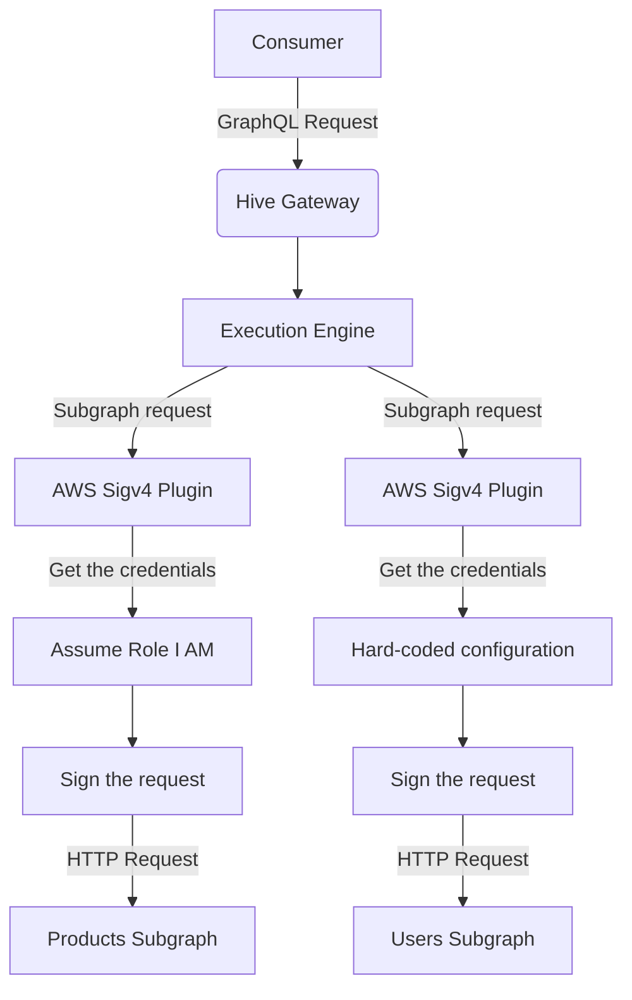

# AWS Signature Version 4 (SigV4)

Hive Gateway allows you to sign subgraph requests with
[AWS Signature Version 4 (SigV4)](https://docs.aws.amazon.com/AmazonS3/latest/API/sig-v4-authenticating-requests.html)
for secure communication between the Gateway and the subgraphs.

## Signing outgoing requests



### How to use?

You can enable AWS SigV4 signing by setting the `awsSigV4.outgoing` option to `true` in the Gateway
configuration.

```ts filename="gateway.config.ts"
import { defineConfig } from '@graphql-hive/gateway'

export const gatewayConfig = defineConfig({
  awsSigV4: {
    outgoing: true
  }
})
```

### Credentials

By default, Hive Gateway will use the standard environment variables to get the AWS credentials. But
you can also provide the credentials directly in the configuration.

```ts filename="gateway.config.ts"
import { defineConfig } from '@graphql-hive/gateway'

export const gatewayConfig = defineConfig({
  awsSigV4: {
    outgoing: {
      accessKeyId: process.env.AWS_ACCESS_KEY_ID,
      secretAccessKey: process.env.AWS_SECRET_ACCESS_KEY,
      region: process.env.AWS_REGION
    }
  }
})
```

#### Assume Role (IAM)

You can provide the `roleArn` and `roleSessionName` to assume a role using the provided credentials.

```ts filename="gateway.config.ts"
import { defineConfig } from '@graphql-hive/gateway'

export const gatewayConfig = defineConfig({
  awsSigV4: {
    outgoing: {
      region: process.env.AWS_REGION,
      // By default it takes the credentials from the environment variables
      roleArn: 'arn:aws:iam::123456789012:role/role-name', // process.env.AWS_ROLE_ARN
      roleSessionName: 'session-name' // process.env.AWS_ROLE_SESSION_NAME
    }
  }
})
```

### Service and region configuration

By default, the plugin extracts the service and region from the URL of the subgraph. But you can
also provide the service and region directly in the configuration.

```ts filename="gateway.config.ts"
import { defineConfig } from '@graphql-hive/gateway'

export const gatewayConfig = defineConfig({
  awsSigV4: {
    outgoing: {
      accessKeyId: process.env.AWS_ACCESS_KEY_ID,
      secretAccessKey: process.env.AWS_SECRET_ACCESS_KEY,
      region: process.env.AWS_REGION,
      serviceName: 'lambda',
      region: 'us-east-1'
    }
  }
})
```

### Subgraph-specific configuration

You can also configure the SigV4 signing for specific subgraphs by setting the `awsSigV4` option in
the subgraph configuration.

```ts filename="gateway.config.ts"
import { defineConfig } from '@graphql-hive/gateway'

export const gatewayConfig = defineConfig({
  awsSigV4: {
    // Allowing SigV4 signing for only the 'products' subgraph
    outgoing: subgraph => subgraph === 'products'
  }
})
```

or you can provide the credentials directly per subgraph.

```ts filename="gateway.config.ts"
import { defineConfig } from '@graphql-hive/gateway'

export const gatewayConfig = defineConfig({
  awsSigV4: {
    // Providing AWS SigV4 credentials for the 'products' and 'users' subgraphs separately
    // And do not allow SigV4 signing for any other subgraph
    outgoing(subgraph) {
      // You can use hardcoded credentials for the 'products' subgraph
      if (subgraph === 'products') {
        return {
          accessKeyId: process.env.PRODUCTS_AWS_ACCESS_KEY_ID,
          secretAccessKey: process.env.PRODUCTS_AWS_SECRET_ACCESS_KEY,
          serviceName: 'lambda',
          region: 'eu-west-1'
        }
      }
      // You can use Assume Role for the 'users' subgraph
      if (subgraph === 'users') {
        return {
          roleArn: 'arn:aws:iam::123456789012:role/role-name',
          roleSessionName: 'session-name',
          serviceName: 's3',
          region: 'us-east-1'
        }
      }
      return false
    }
  }
})
```

## Validating incoming requests

Hive Gateway can also mimic AWS services by validating the incoming requests with AWS SigV4.

But you have to provide some credentials using environment variables or directly in the
configuration.

```ts filename="gateway.config.ts"
import { defineConfig } from '@graphql-hive/gateway'

export const gatewayConfig = defineConfig({
  awsSigV4: {
    incoming: {
      // Hard-coded secret
      secretAccessKey: () => process.env.AWS_SECRET_ACCESS_KEY,

      // Or Assume Role
      assumeRole: () => ({
        roleArn: process.env['AWS_ROLE_ARN'],
        roleSessionName: process.env['AWS_ROLE_SESSION_NAME'],
        region: process.env['AWS_REGION']
      })
    }
  }
})
```

### Combining with JWT

If you use JWT for authentication for some services, you can combine both depending on the prefix in
the `Authorization` header.

In this case if the `Authorization` header starts with `Bearer`, the JWT will be used for
authentication, otherwise, the request will be validated with AWS SigV4.

```ts filename="gateway.config.ts"
import { defineConfig } from '@graphql-hive/gateway'

export const gatewayConfig = defineConfig({
  awsSigV4: {
    incoming: true
  },
  jwt: {
    reject: {
      missingToken: false,
      invalidToken: false
    }
  }
})
```
