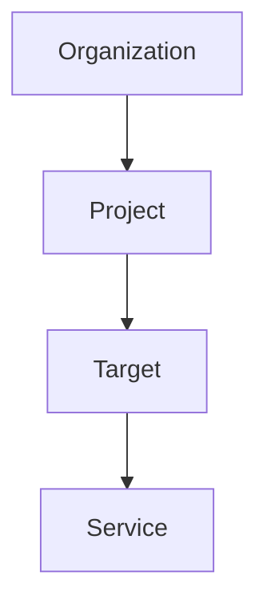
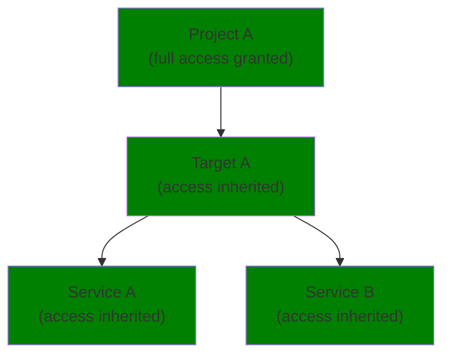
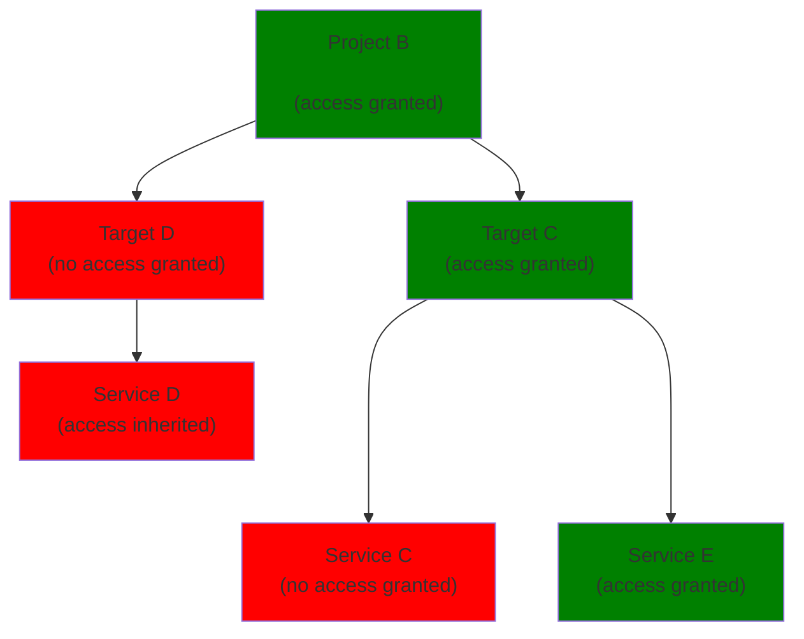

import NextImage from 'next/image'
import { Callout } from '@theguild/components'

# Member, Roles, and Permissions

A Hive organization can have an unlimited number of members. Member actions are allowed or
explicitly denied using roles, which are named collections of permissions.

Hive provides two predefined member roles for convenience. Alternatively, organization owners or
members with specific permissions can create and/or assign custom roles tailored to your teams
workflows.

When assinging a role to an user, the permissionsgranted by that role can be restricted to a set of
resources (projects, targets, or services). For example, this allows to do the following.

- Fully or partially access to projects to a group of users
- Limit who can approve a breaking change for a specific GraphQL service

## Managing Members

Managing members, roles and permissions is done within the organizations `Member` section on the
Hive Dashboard.

Organization owners or organization members with sufficient permissions can access this section.

import membersTabImage from '../../../public/docs/pages/management/members-roles-permissions/members-tab.png'

<NextImage
  alt="Organization Member Section"
  src={membersTabImage}
  className="mt-8 rounded-lg drop-shadow-md"
/>

## Member Roles

Member roles specify the actions an organization member can perform within the organization. Each
organization member has a member role assigned.

### Predefined Member Roles

Each organization comes with a set of predefined member roles ready to use and assign to
organization members. These roles are read-only, permissions can not be added or removed.

| Role Name | Description                                                                                                          |
| --------- | -------------------------------------------------------------------------------------------------------------------- |
| Admin     | Full access to everything within the organization.                                                                   |
| Viewer    | Full read access to everything within the organization. The default role for users added/invited to an organization. |

### Creating Member Roles

Instead of using the predefined member roles you can create your own member roles. Managing member
roles is done within the `Roles` tab within the member section.

import createRole01StartImage from '../../../public/docs/pages/management/members-roles-permissions/create-role-01-start.png'

<NextImage
  alt="Members of an Organization"
  src={createRole01StartImage}
  className="mt-8 rounded-lg drop-shadow-md"
/>

Click the `Create new role` button for opening the wizard.

import createRole02WizardImage from '../../../public/docs/pages/management/members-roles-permissions/create-role-02-wizard.png'

<NextImage
  alt="Member Role Creator"
  src={createRole02WizardImage}
  className="mt-8 rounded-lg drop-shadow-md"
/>

Choose a name and a description for your new role. Then select the permissions for that role.

Some permissions depend on each other. E.g. you can not allow deleting a project without granting
the permissions for viewing a project.

Once you are satisfied with your selection, click the `Confirm selection` button, for getting a full
overview about the permissions that will be assigned to that role.

import createRole03ConfirmImage from '../../../public/docs/pages/management/members-roles-permissions/create-role-03-confirm.png'

<NextImage
  alt="Member Role Creator - Permission Overview"
  src={createRole03ConfirmImage}
  className="mt-8 rounded-lg drop-shadow-md"
/>

Here you, can double check your selection and proceed with the creation of the role by pressing the
`Create role` button.

The role will now be visible next to the other roles within the overview and is ready to be assigned
to a organization member.

import createRole04SuccessImage from '../../../public/docs/pages/management/members-roles-permissions/create-role-04-success.png'

<NextImage
  alt="Member Role Creator - Permission Overview"
  src={createRole04SuccessImage}
  className="mt-8 rounded-lg drop-shadow-md"
/>

### Update Member Roles

Member roles that are not predefined (readonly), can be updated on the `Roles` tab within the member
section.

Via the triple dot menu on the member role, select the `Edit` action.

import updateRole01StartImage from '../../../public/docs/pages/management/members-roles-permissions/update-role-01-start.png'

<NextImage
  alt="Update member role"
  src={updateRole01StartImage}
  className="mt-8 rounded-lg drop-shadow-md"
/>

Within the member role editor, adjust the permissions of the role as desired, then confirm the
selection.

import updateRole02EditorImage from '../../../public/docs/pages/management/members-roles-permissions/update-role-02-editor.png'

<NextImage
  alt="Update member role editor"
  src={updateRole02EditorImage}
  className="mt-8 rounded-lg drop-shadow-md"
/>

After that the permissions for the role are updated.

### Delete Member Roles

Member roles that are not predefined (readonly), can be deleted on the `Roles` tab within the member
section.

In case you want to delete a member role that is still assigned to members, you first need to
[assign a different role to the members using that role](./members-roles-permissions.mdx#assigning-roles).

Via the triple dot menu on the member role, select the `Delete` action.

import deleteRole01StartImage from '../../../public/docs/pages/management/members-roles-permissions/delete-role-01-start.png'

<NextImage
  alt="Delete member role"
  src={deleteRole01StartImage}
  className="mt-8 rounded-lg drop-shadow-md"
/>

Confirm the deletion in the dialog using the `Confirm` button to successfully delete the member
role.

import deleteRole02ConfirmImage from '../../../public/docs/pages/management/members-roles-permissions/delete-role-02-confirm.png'

<NextImage
  alt="Delete member role confirmation"
  src={deleteRole02ConfirmImage}
  className="mt-8 max-w-lg rounded-lg drop-shadow-md"
/>

## Members

Organization members are users that have a member roles assigned. The member role specifies the
actions the member can perform within an organization.

A member can join an organization either via an
[invite by email](./members-roles-permissions.mdx#inviting-new-members) or via
[Single Sign On (SSO) through a OIDC provider](./sso-oidc-provider.mdx) connected to the
organization.

### Inviting new Members

To invite others to your organization, go to **Members** tab under your organization. To invite a
new member to your organization, write their email address and click on **Send an invite** button.

import orgInviteMemberImage from '../../../public/docs/pages/management/org-invite-member.png'

<NextImage
  alt="Invite Member to Organization"
  src={orgInviteMemberImage}
  className="mt-8 rounded-lg drop-shadow-md"
/>

The new member will receive an email inviting them to join Hive as a user, and this will add them as
a member to your Hive organization.

Once an invite has been created, you can also copy the personal invite link and share it directly
using your preferred method.

import orgInviteLinkImage from '../../../public/docs/pages/management/org-invite-link.png'

<NextImage
  alt="Copy Invite Link"
  src={orgInviteLinkImage}
  className="mt-8 max-w-lg rounded-lg drop-shadow-md"
/>

### Assigning Roles to Members

The actions a member can perform within the organization are specified by the assigned role. By
default a organization member is assigned the `Viewer` role, however, you can assign any predefined
or custom role you created.

Within the `Members` section, you can see the assigned role for each member.

> Organization owners always have full access to the organization and cannot be assigned a role.

For changing the assigned role click the `change` button.

import assignRole01Image from '../../../public/docs/pages/management/members-roles-permissions/assign-role-01-start.png'

<NextImage
  alt="Organization Member Overview"
  src={assignRole01Image}
  className="mt-8 max-w-lg rounded-lg drop-shadow-md"
/>

Clicking the `change` button opens a menu for selecting the role for that user, when selecting a
role you can see an overview of permissions that this role grants to this user.

import assignRole02Image from '../../../public/docs/pages/management/members-roles-permissions/assign-role-02-overview.png'

<NextImage
  alt="Assign member role"
  src={assignRole02Image}
  className="mt-8 max-w-lg rounded-lg drop-shadow-md"
/>

Confirm the selecton by via the `Assign role to user` button.

#### Restrict Resources Access

Sometimes you might want to restrict a organization member to only being able to access a specific
project, or only approve failed schema checks of a set of services.

When assigning a role to an organization member, you can specify on which resources the permissions
granted by the member role should apply.

The grants follow the hierachical order of resources within Hive. Permissions on the organization
level are always granted, these can only be restricted by the permissions defined in the member
role.

For each level and selected resource, you can either choose to apply the permissions for all
sub-resources (inherit) or specify a granular sub-selection.

<Callout type="info">
  **Note:** Read access to targets and services is automatically inherited from the project. The
  interfaces and analytics of the Hive dashboard are very closely tied to all the targets, so
  restricting read/view access to single targets/services does not make sense.
</Callout>

**Example: Full access on project**

When selecting full access for a project, the permissions are automatically applied to all the
sub-resources (targets, services) within the project.

**Example: Granular access on project**

When selecting grnular access for a project, you can further specify which targets and which
services are included within the selection.

In order assign resources, select `Granular Access` within the `Assigned Resources` section, then
assign your resources (projects, targets, services) as desired.

import assignRole03Image from '../../../public/docs/pages/management/members-roles-permissions/assign-role-03-granular-access-service.png'

<NextImage
  alt="Select Granular Access Mode"
  src={assignRole03Image}
  className="mt-8 max-w-lg rounded-lg drop-shadow-md"
/>

After confirming the selection and assigning the role, permissions specified by the member role will
only be granted for the selected resources.
