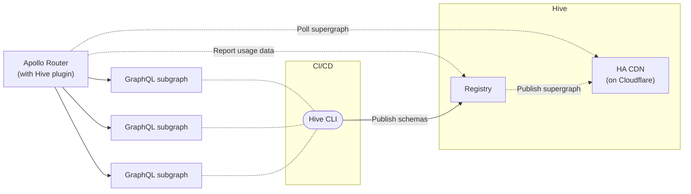

import { Callout, Tabs } from '@theguild/components'

# Apollo Router

[Apollo Router](https://www.apollographql.com/docs/router/) is the Rust implementation of the Apollo
Federation runtime.

Hive ships a custom build of Apollo Gateway,
[because that's how native extensions works](https://www.apollographql.com/docs/router/customizations/native).

With the custom build, Apollo Gateway will poll the supergraph from the high availability CDN to
ensure production deployments without interruptions.



## Installation

Make sure you have
[published all your subgraph schemas to your Federation target](/docs/get-started/apollo-federation#publish-your-schemas)
on the Hive registry. Once you have all subgraph schemas published and the subgraphs can be
composed, the latest valid supergraph is always available via the CDN.

You also need to [create a CDN Access Token](/docs/high-availability-cdn#cdn-access-tokens), that
will be used for authenticating the supergraph polling from the CDN.

<Tabs items={['Binary', 'Docker', 'Custom']}>
  <Tabs.Tab>
    Download Apollo Router for Linux (`x86_64`), MacOS (`x86_64`) or Windows (`x86_64`). To download the latest version of the router, use the following script:

    ```bash
    curl -fsSL https://graphql-hive.com/apollo-router-download.sh | bash
    ```

    To download a specfic version of the router, use the `-v` or `--version` flag:

    ```bash
    curl -fsSL https://graphql-hive.com/apollo-router-download.sh | bash -s -- --version router1.57.1-plugin1.0.0
    ```

    > The full list of releases can be found in the [releases registry page](https://github.com/graphql-hive/console/pkgs/container/apollo-router)

    Start the router:

    ```bash
    HIVE_CDN_ENDPOINT="..." \ # The endpoint of your CDN access token
    HIVE_CDN_KEY="..." \ # The CDN access token
      ./router
    ```

  </Tabs.Tab>
  <Tabs.Tab>
      To run Apollo Router with Hive plugin, use the following Docker command.

      Make sure to replace `IMAGE_TAG_HERE` with the image tag. You can use `latest` for development, or pick a specific version for production from the [releases registry page](https://github.com/graphql-hive/console/pkgs/container/apollo-router).

      ```bash
      docker run -p 4000:4000 \
        --env HIVE_CDN_ENDPOINT="..." \ # The endpoint of your CDN access token
        --env HIVE_CDN_KEY="..." \ # The CDN access token
        --rm \
        ghcr.io/graphql-hive/apollo-router:IMAGE_TAG_HERE
      ```

      Passing command-line arguments:

      ```bash
      docker run -p 4000:4000 \
        --env HIVE_CDN_ENDPOINT="..." \ # The endpoint of your CDN access token
        --env HIVE_CDN_KEY="..." \ # The CDN access token
        --rm \
        ghcr.io/graphql-hive/apollo-router:IMAGE_TAG_HERE --log debug
      ```

  </Tabs.Tab>

  <Tabs.Tab>
    Creating a custom Apollo Router binary requires compiling it from source.
    To setup a project, please follow ["Create a new project"](https://www.apollographql.com/docs/router/customizations/custom-binary/#1-create-a-new-project) section of "Creating a custom Apollo Router binary" guide.

    Once your project is ready, update `Cargo.toml` file with the [`hive_apollo_router_plugin`](https://crates.io/crates/hive-apollo-router-plugin) Crate dependency:

    ```toml filename="Cargo.toml"
    [dependencies]
    # You can find the version additional information in Crates.io:
    # https://crates.io/crates/hive-apollo-router-plugin
    hive_apollo_router_plugin = "..."
    ```

    Alternatively, you can point to a Git if you need a specific commit or version of the plugin:

    ```toml filename="Cargo.toml"
    [dependencies]
    # You can use a "branch", or commit id with "rev" key
    hive_apollo_router_plugin = { git = "https://github.com/graphql-hive/console", branch = "main" }
    ```

    Next, update `src/main.rs` file with the following content to add GraphQL Hive:

    ```diff filename="src/main.rs"
      mod plugins;

      use anyhow::Result;
    + use hive_apollo_router_plugin::registry;

      fn main() -> Result<()> {
    -   apollo_router::main()
    +   match registry::HiveRegistry::new(None).and(apollo_router::main()) {
    +     Ok(_) => {}
    +     Err(e) => {
    +         eprintln!("{}", e);
    +         std::process::exit(1);
    +     }
    +   }
      }
    ```

    Finally, [build the binary](https://www.apollographql.com/docs/router/customizations/custom-binary/#2-compile-the-router) and [run it](https://www.apollographql.com/docs/router/customizations/custom-binary/#3-run-the-compiled-binary) using `HIVE_CDN_ENDPOINT` and `HIVE_CDN_KEY` environment variables.

    In case of any issues, please refer to the [official guide](https://www.apollographql.com/docs/router/customizations/custom-binary/) or [open an issue](https://github.com/graphql-hive/platform/issues/new) in GraphQL Hive repository.

  </Tabs.Tab>
</Tabs>

### Version Structure

The Docker image's and the binary artifact's versioning follows the pattern
`routerX.Y.Z-pluginX.Y.Z`, combining both the core
[Apollo Router](https://crates.io/crates/apollo-router) and
[Hive plugin](https://crates.io/crates/hive-apollo-router-plugin) versions.

For example: `router1.57.1-plugin1.0.0`.

You can find the list of releases in the
[releases registry page](https://github.com/graphql-hive/console/pkgs/container/apollo-router).

## Configuration

- `HIVE_CDN_ENDPOINT` - the endpoint Hive generated for you in the previous step
- `HIVE_CDN_KEY` - the access key
- `HIVE_CDN_POLL_INTERVAL` - polling interval (default is 10 seconds)
- `HIVE_CDN_ACCEPT_INVALID_CERTS` - accepts invalid SSL certificates (default is `false`)
- `HIVE_REGISTRY_LOG` - defines the log level for the registry (default is `INFO`)
- `HIVE_CDN_SCHEMA_FILE_PATH` - where to download the supergraph schema (default is
  `/<tmp-dir>/supergraph-schema.graphql`)

<Callout>
  The `HIVE_CDN_ENDPOINT` variable should not include any artifact suffix (for example,
  `/supergraph`), it should be in the following format:
  `https://cdn.graphql-hive.com/artifacts/v1/TARGET_ID`
</Callout>

## Usage Reporting

You can send usage reporting to Hive registry by enabling `hive.usage` plugin in the config file
(`router.yaml`).

### Configuration

- `HIVE_TOKEN` (**required**) - Your
  [Registry Access Token](/docs/management/targets#registry-access-tokens) with write permission.
- `HIVE_ENDPOINT` (**optional**) - For self-hosting, you can override `/usage` endpoint (defaults to
  `https://app.graphql-hive.com/usage`)
- `HIVE_TARGET_ID` - A target ID, this can either be a slug following the format
  "$organizationSlug/$projectSlug/$targetSlug" (e.g "the-guild/graphql-hive/staging") or an UUID
  (e.g. "a0f4c605-6541-4350-8cfe-b31f21a4bf80"). To be used when `HIVE_TOKEN` is configured with an
  organization access token.

<Tabs items={['Binary', 'Docker', 'Custom']}>
  <Tabs.Tab>
    Start the router:

    ```bash
    HIVE_TOKEN="..." \
    HIVE_CDN_ENDPOINT="..." \
    HIVE_CDN_KEY="..." \
      ./router --config router.yaml
    ```

  </Tabs.Tab>
  <Tabs.Tab>
      To run Apollo Router with Hive plugin with usage reporting, use the following Docker command.

      Make sure to replace `IMAGE_TAG_HERE` with the image tag. You can use `latest` for development, or pick a specific version for production from the [releases registry page](https://github.com/graphql-hive/console/pkgs/container/apollo-router).


      ```bash
      docker run -p 4000:4000 \
        --env HIVE_TOKEN="..." \
        --env HIVE_CDN_ENDPOINT="..." \
        --env HIVE_CDN_KEY="..." \
        --mount "type=bind,source=/home/usr/src/hive/router.yaml,target=/dist/config/router.yaml" \
        --rm \
        ghcr.io/graphql-hive/apollo-router:IMAGE_TAG_HERE
      ```

      To follow the same convention as Apollo Router's official Docker image, the config file is also located at `/dist/config/router.yaml`.

  </Tabs.Tab>

  <Tabs.Tab>
    Creating a custom Apollo Router binary requires compiling it from source.
    To setup a project, please follow ["Create a new project"](https://www.apollographql.com/docs/router/customizations/custom-binary/#1-create-a-new-project) section of "Creating a custom Apollo Router binary" guide.

    Once your project is ready, update `Cargo.toml` file with the [`hive_apollo_router_plugin`](https://crates.io/crates/hive-apollo-router-plugin) Crate dependency:

    ```toml filename="Cargo.toml"
    [dependencies]
    # You can find the version additional information in Crates.io:
    # https://crates.io/crates/hive-apollo-router-plugin
    hive_apollo_router_plugin = "..."
    ```

    Alternatively, you can point to a Git if you need a specific commit or version of the plugin:

    ```toml filename="Cargo.toml"
    [dependencies]
    # You can use a "branch", or commit id with "rev" key
    hive_apollo_router_plugin = { git = "https://github.com/graphql-hive/console", branch = "main" }
    ```

    Next, update `src/main.rs` file with the following content to add GraphQL Hive:

    ```diff filename="src/main.rs"
      mod plugins;

      use anyhow::Result;
    + use apollo_router::register_plugin;
    + use hive_apollo_router_plugin::registry;
    + use hive_apollo_router_plugin::usage::UsagePlugin;

      fn main() -> Result<()> {
    -   apollo_router::main()

    + // Register the Hive usage_reporting plugin
    + register_plugin!("hive", "usage", UsagePlugin);

    +   match registry::HiveRegistry::new(None).and(apollo_router::main()) {
    +     Ok(_) => {}
    +     Err(e) => {
    +         eprintln!("{}", e);
    +         std::process::exit(1);
    +     }
    +   }
      }
    ```

    Finally, [build the binary](https://www.apollographql.com/docs/router/customizations/custom-binary/#2-compile-the-router) and [run it](https://www.apollographql.com/docs/router/customizations/custom-binary/#3-run-the-compiled-binary) using `HIVE_TOKEN`, `HIVE_CDN_ENDPOINT` and `HIVE_CDN_KEY` environment variables.
    Don't forget to create `router.yaml` file with configuration for `hive.usage` plugin.

    In case of any issues, please refer to the [official guide](https://www.apollographql.com/docs/router/customizations/custom-binary/) or [open an issue](https://github.com/graphql-hive/platform/issues/new) in GraphQL Hive repository.

  </Tabs.Tab>
</Tabs>

```yaml filename="router.yaml"
supergraph:
  listen: 0.0.0.0:4000
plugins:
  hive.usage:
    {}
    #  Default: true
    # enabled: true
    #
    #  Sample rate to determine sampling.
    #  0.0 = 0% chance of being sent
    #  1.0 = 100% chance of being sent.
    #  Default: 1.0
    # sample_rate: "0.5",
    #
    #  A list of operations (by name) to be ignored by Hive.
    # exclude: ["IntrospectionQuery", "MeQuery"],
    #
    #  Uses graphql-client-name by default
    # client_name_header: "x-client-name",
    #  Uses graphql-client-version by default
    # client_version_header: "x-client-version",
    #
    #  A maximum number of operations to hold in a buffer before sending to GraphQL Hive
    #  Default: 1000
    # buffer_size: 1000
    #
    #  Accepts invalid SSL certificates
    #  Default: false
    # accept_invalid_certs: true
```

## Persisted Documents (App Deployments)

To activate [App Deployments](/docs/schema-registry/app-deployments) in your Apollo Router, you need
to enable the `hive.persisted_documents` plugin. The plugin uses the `HIVE_CDN_ENDPOINT` and
`HIVE_CDN_KEY` environment variables to resolve the persisted documents IDs.

```yaml filename="router.yaml"
# ... the rest of your configuration
plugins:
  hive.usage: {}
  hive.persisted_documents:
    enabled: true
```

Once enabled, follow the
[App Deployments guide](/docs/schema-registry/app-deployments#sending-persisted-document-requests-from-your-app)
to send persisted document requests from your app, using the Hive CDN for resolving the document
IDs.

### Configuration

The following environment variables are required:

- `HIVE_CDN_ENDPOINT` - the endpoint Hive generated for you in the previous step (for example:
  `https://cdn.graphql-hive.com/artifacts/v1/TARGET_ID/supergraph`)
- `HIVE_CDN_KEY` - the access key to Hive CDN

You may configure the plugin with the following options:

```yaml filename="router.yaml"
# ... the rest of your configuration
plugins:
  hive.usage: {}
  hive.persisted_documents:
    # Enables/disables the plugin
    # Default: true
    enabled: true
    # The endpoint of the Hive CDN. You can either specify it here, or use the existing HIVE_CDN_ENDPOINT environment variable.
    # Required
    endpoint: 'https://cdn.graphql-hive.com/artifacts/v1/TARGET_ID/supergraph'
    # The access key to the Hive CDN. You can either specify it here, or use the existing HIVE_CDN_KEY environment variable.
    # Required
    key: '...'
    # Enables/disables the option to allow arbitrary documents to be executed.
    # Optional
    # Default: false
    allow_arbitrary_documents: false
    # HTTP connect timeout in seconds for the Hive CDN requests.
    # Optional
    # Default: 5
    connect_timeout: 5
    # HTTP request timeout in seconds for the Hive CDN requests.
    # Optional
    # Default: 15
    request_timeout: 15
    # Accepts invalid SSL certificates for the Hive CDN requests.
    # Optional
    # Default: false
    accept_invalid_certs: false
    # The maximum number of documents to hold in a LRU cache.
    # Optional
    # Default: 1000
    cache_size: 1000
```

### Use as library

You may also add the persisted-documents plugin:

```toml filename="Cargo.toml"
[dependencies]
# You can use a "branch", or commit id with "rev" key
hive_apollo_router_plugin = { git = "https://github.com/graphql-hive/console", branch = "main" }
```

Next, update `src/main.rs` file with the following content to add GraphQL Hive:

```diff filename="src/main.rs"
  mod plugins;

  use anyhow::Result;
+ use apollo_router::register_plugin;
+ use hive_apollo_router_plugin::registry;
+ use hive_apollo_router_plugin::persisted_documents::PersistedDocumentsPlugin;

  fn main() -> Result<()> {
-   apollo_router::main()

+ // Register the persisted documents plugin, if needed
+ register_plugin!("hive", "persisted_documents", PersistedDocumentsPlugin);

+   match registry::HiveRegistry::new(None).and(apollo_router::main()) {
+     Ok(_) => {}
+     Err(e) => {
+         eprintln!("{}", e);
+         std::process::exit(1);
+     }
+   }
  }
```

If you are using both plugins (usage and persisted operations), you'll need to have a
`register_plugin!` call to both plugins.

## Additional Resources

- [Get started with Apollo Federation and Hive guide](/docs/get-started/apollo-federation)
- [Apollo Router documentation](https://www.apollographql.com/docs/router/)
- [Hive Plugin for Apollo-Router @ Crates.io](https://crates.io/crates/hive-apollo-router-plugin)
