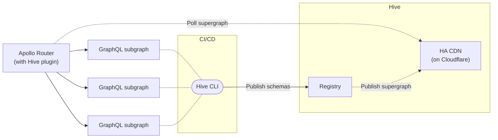

# Open Source Apollo GraphOS Alternative

Hive stands as a **compelling alternative to Apollo GraphOS**. With a various of features and
benefits, Hive has proven itself as an exceptional choice for both individual developers and teams
seeking a powerful GraphQL development environment.

## Seamless Integration with Apollo Ecosystem

One of GraphQL Hive's standout features is its **seamless integration with the Apollo ecosystem**.
It works alongside the [Apollo Router](/docs/other-integrations/apollo-router) and
[Apollo Gateway](/docs/other-integrations/apollo-gateway), ensuring a consistent and smooth
experience for users. This integration extends to supporting
[Apollo Federation v1 and v2](/federation), allowing you to leverage the advantages of federated
architectures while benefiting from GraphQL Hive's capabilities.

## Familiar Interface and Transition

For those fimiliar with using Rover CLI, transitioning to Hive is remarkably straightforward. The
[Hive CLI](/docs/api-reference/cli) has a **similar interface, minimizing the learning curve for
existing users**. This aspect simplifies the migration process from Apollo GraphOS to Hive, allowing
developers to quickly adapt and continue their work without interruption.

## Open Source GraphQL Federation Platform

Built on a foundation of open source technologies like
[Postgres, ClickHouse, and Redis](https://github.com/graphql-hive/platform/blob/main/docker/docker-compose.community.yml),
**GraphQL Hive champions the open source ethos**. Entirely MIT licensed, it offers unparalleled
freedom to its users, enabling them to customize and extend the platform as needed. This commitment
to openness also helps developers avoid vendor lock-in, granting them full control over their
GraphQL infrastructure.

Hive does not gate any features behind a paywall. Self-hosted and cloud-hosted options are
identical.

Both Hive Console (Schema Registry and Observability) and Hive Gateway are fully open source and
MIT-licensed.

## On-Premise and Cloud Hosting Options

Whether you're working on a side project or managing a larger beast, Hive caters to your hosting
needs. The [self-hosting](/docs/self-hosting/get-started) option is entirely free, eliminating any
limitations on usage. Furthermore, [GraphQL Hive Cloud](https://the-guild.dev/graphql/hive) offers a
free Hobby plan, perfectly suited for most side projects. For those seeking more advanced features
and capabilities, the Pro plan comes with a 30-day free trial, ensuring you find the best fit for
your requirements.

---

According to our users, Hive presents itself as an exceptional alternative to Apollo GraphOS,
offering a seamless integration with the Apollo ecosystem, a familiar CLI interface, robust
features, open source flexibility, scalable hosting options, and comprehensive monitoring
capabilities. The transition from Apollo Studio (Apollo GraphOS) to GraphQL Hive is a
straightforward step, allowing you to harness the power of GraphQL development to its fullest
potential.
