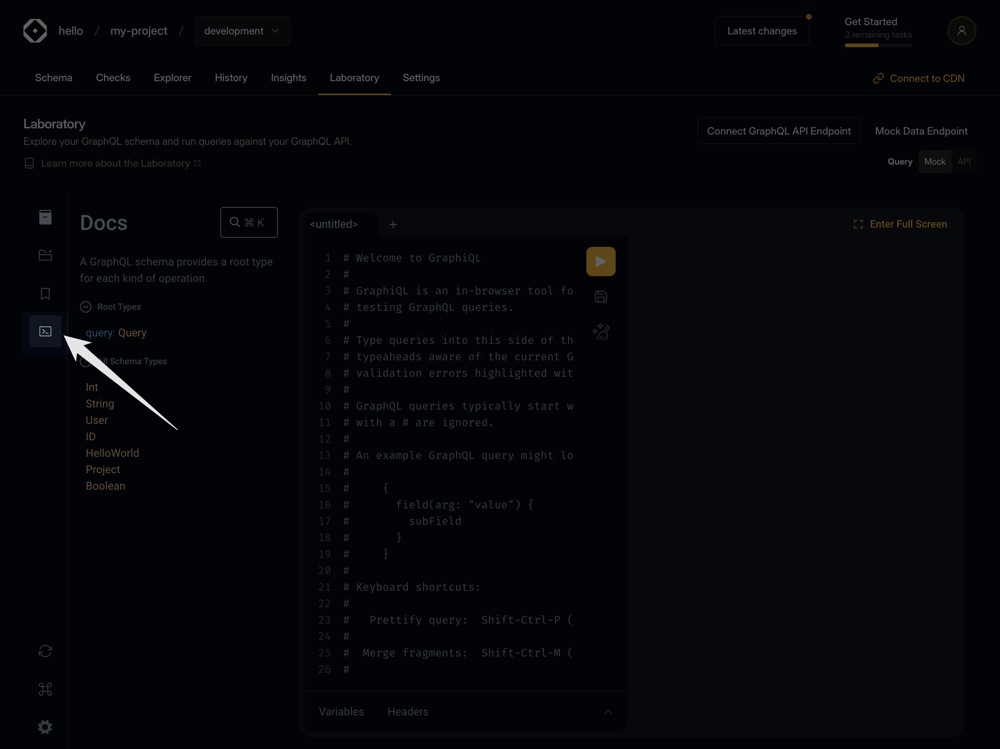
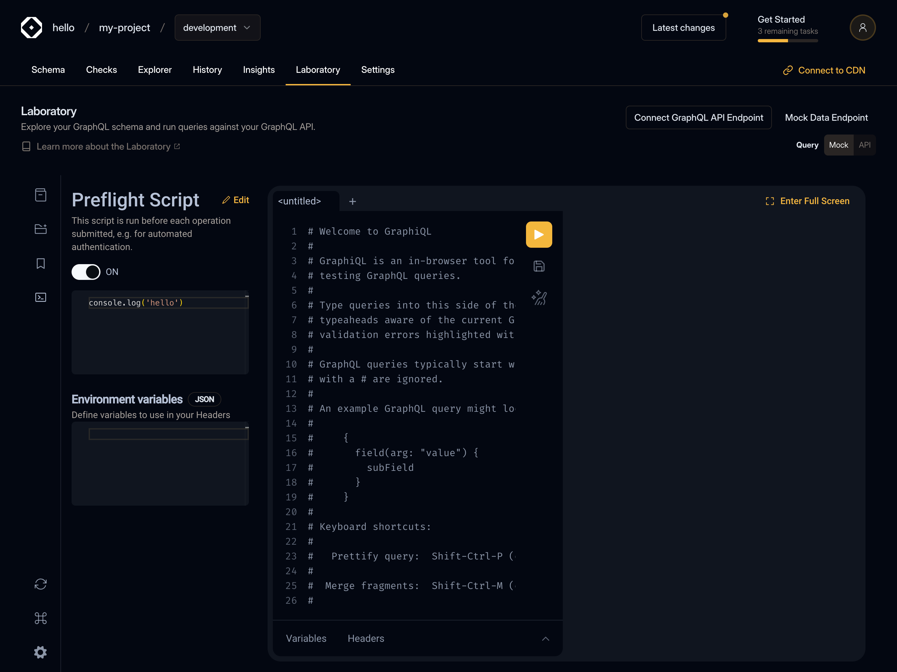
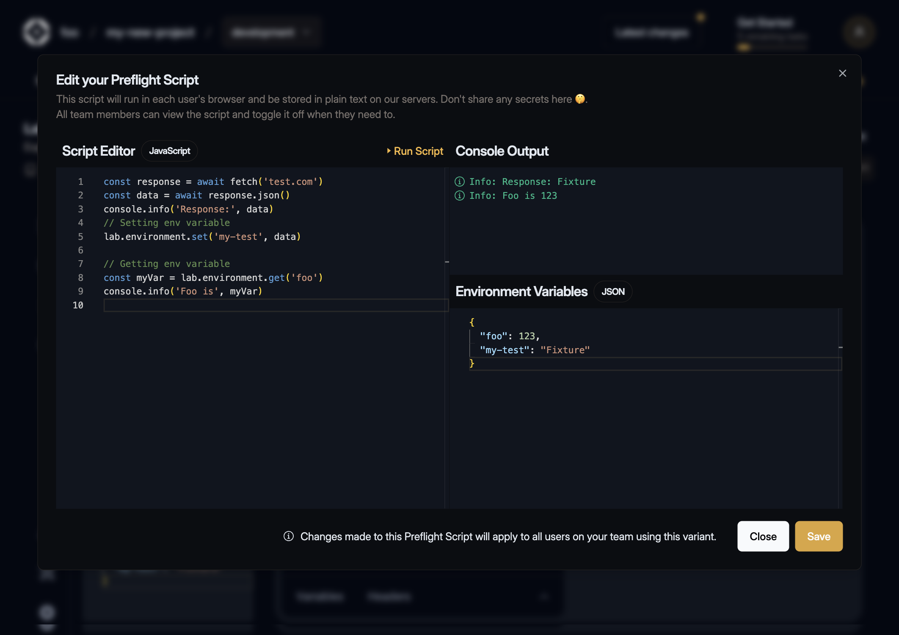
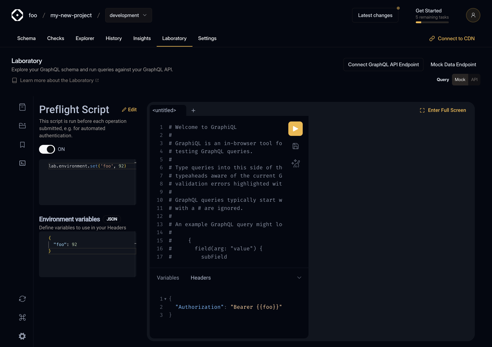

---
description:
  Useful for handling authentication flows like OAuth, where you may need to refresh an access token
---

# Preflight Scripts

import { Callout } from '@theguild/components'
import { Screenshot } from '../../../../components/screenshot'

export const figcaptionClass = 'text-center text-sm mt-2'

These scripts allow you to automatically run custom authentication processes before executing your
GraphQL operations. They're especially useful for handling authentication flows like OAuth, where
you may need to refresh an access token. Let's explore how it works.

## Configuring Preflight Script

To create a script click on the command line icon (right after Operation Collections plugin icon) in
GraphiQL sidebar section.

<figure className="mt-6">
  <Screenshot></Screenshot>
  {/* prettier-ignore */}
  <figcaption className={figcaptionClass}>The preflight script is accessible by clicking on the Command line icon in the GraphiQL sidebar</figcaption>
</figure>

You will see Script editor (JavaScript language) which is read-only and present for a quick view of
your saved script and Environment variables editor (JSON language) which is persistent in
localStorage.

<figure className="mt-6">
  <Screenshot></Screenshot>
  <figcaption className={figcaptionClass}>Preflight script plugin view</figcaption>
</figure>

## Editing Preflight Script

Clicking on the `Edit` button will open Modal where you can edit, test and save your script in
database.

<Callout type="warning">
  **Note**: Your script will stored as plain text in our database, don't put any secrets there, use
  Environment variables editor for it! The preflight script is accessible to all members of your
  organization, but only users with access to target Settings can edit the script code.
</Callout>

You can use any JavaScript syntax (including top-level `await`) in the Script editor. Getting and
Setting environment variables is done by accessing the `environment` property on the `lab` global
variable.

```js
// get myKey variable from the Environment variables editor
lab.environment.get('myKey')
// set myKey variable to the Environment variables editor (persistent in localStorage)
lab.environment.set('myKey', myValue)
```

<figure className="mt-6">
  <Screenshot></Screenshot>
  <figcaption className={figcaptionClass}>Demo how to get and set environment variables</figcaption>
</figure>

## CryptoJS

Additionally, you can access [the CryptoJS library](https://github.com/brix/crypto-js) by accessing
the `CryptoJS` property on the `lab` global variable.

<figure className="mt-6">
  <Screenshot></Screenshot>
  <figcaption className={figcaptionClass}>CryptoJS</figcaption>
</figure>

## Global Variables and Errors

Access to global variables such as `this`, `window` or `globalThis` is restricted. Errors thrown by
the script will be displayed in Console Output.

<figure className="mt-6">
  <Screenshot></Screenshot>
  <figcaption className={figcaptionClass}>Demo restricted access to global variables</figcaption>
</figure>

## Using Environment Variables

To use your environment variables in GraphiQL headers editor wraps environment keys with
double-curly braces, e.g.:

```json filename="Headers" /{{myEnvVar}}/
{
  "Authorization": "Bearer {{myEnvVar}}"
}
```

<figure className="mt-6">
  <Screenshot></Screenshot>
  {/* prettier-ignore */}
  <figcaption className={figcaptionClass}>Replace syntax is done via double open/closed curly braces, e.g. `{{ myEnvVar }}`</figcaption>
</figure>
