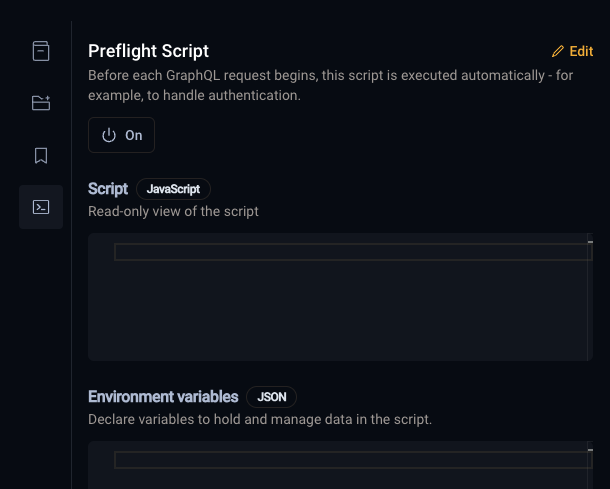
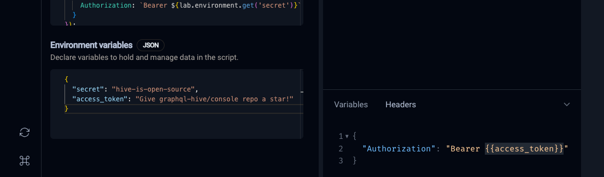

---
description:
  Useful for handling authentication flows like OAuth, where you may need to refresh an access token
---

# Preflight Scripts

import { Callout } from '@theguild/components'
import { Screenshot } from '../../../../components/screenshot'

export const figcaptionClass = 'text-center text-sm mt-2'

**Preflight Scripts** is a feature that enables you to automatically execute custom code before each
GraphQL request is made. They're especially useful for handling authentication flows like OAuth,
where you may need to claim or refresh an access token, validate credentials, or set up custom
headers - all before the request is sent.

## Configuring Preflight Script

Navigate to the sidebar section and click the terminal icon to create a preflight script.

The interface displays two editors:

- a **read-only Script editor** in JavaScript for viewing the saved script,
- an **Environment Variables editor** in JSON that persists data in localStorage.

<Screenshot></Screenshot>

## API Reference

When writing a preflight script, you have access to some of browser APIs and majority of JavaScript
features, including [Fetch API](https://developer.mozilla.org/en-US/docs/Web/API/Fetch_API),
[console](https://developer.mozilla.org/en-US/docs/Web/API/console) or top level `await` syntax.
Additionally, the Laboratory provides a few methods designed to simplify common workflows, such as
handling authentication or interacting with the user.

### Environment Variables

You can use the `lab.environment` API to store and retrieve data between requests or to pass values
directly to HTTP headers for executed GraphQL requests.

`lab.environment.set(key: string, value: any): void`

Sets the value of the environment variable with the given key.

`lab.environment.get(key: string): any`

Returns the value of the environment variable with the given key.

```js
lab.environment.set('myKey', 'myValue')
lab.environment.get('myKey') // 'myValue'
```

Environment variables are persisted in the browser, they are not shared between different users or
devices.

### User Interactions

{/* TODO: explain */}

`lab.prompt(message: string, defaultValue?: string): Promise<string | null>`

Prompts the user with a message and an optional default value. Returns a promise that resolves with
the user's input or `null` if the user cancels the prompt.

```js
const username = await lab.prompt('Enter your username')
const password = await lab.prompt('Enter your password')
```

### CryptoJS

For certain workflows, you may need to encrypt or decrypt data. The Laboratory provides access to
the [CryptoJS](https://cryptojs.gitbook.io/docs) library.

```js
CryptoJS.MD5('Message')
CryptoJS.HmacSHA256('Message', 'Secret Passphrase')
```

## Editing Preflight Script

Clicking the "Edit" button opens a window that allows you to edit, test, and save your script in
Hive.

<Callout type="warning">
  **Note**: Your script will stored as plain text in our database, don't put any secrets there, use
  Environment variables editor for it! The preflight script is accessible to all members of your
  organization, but only users with access to target Settings can edit the script code.
</Callout>

As you write your script, you can click the "Run" button to test it. The script will run in a
sandboxed environment, and you can see the output in the console.

Once you're satisfied with your script, click the "Save" button to persist it for all users in your
organization.

<Screenshot></Screenshot>

## Using Environment Variables in HTTP Headers

To use environment variables in the HTTP headers of your GraphQL requests, wrap the keys in double
curly braces, for example:

```json filename="Headers" /{{access_token}}/
{
  "Authorization": "Bearer {{access_token}}"
}
```

This will replace `{{access_token}}` with the value of the `access_token` environment variable.

<Screenshot></Screenshot>
