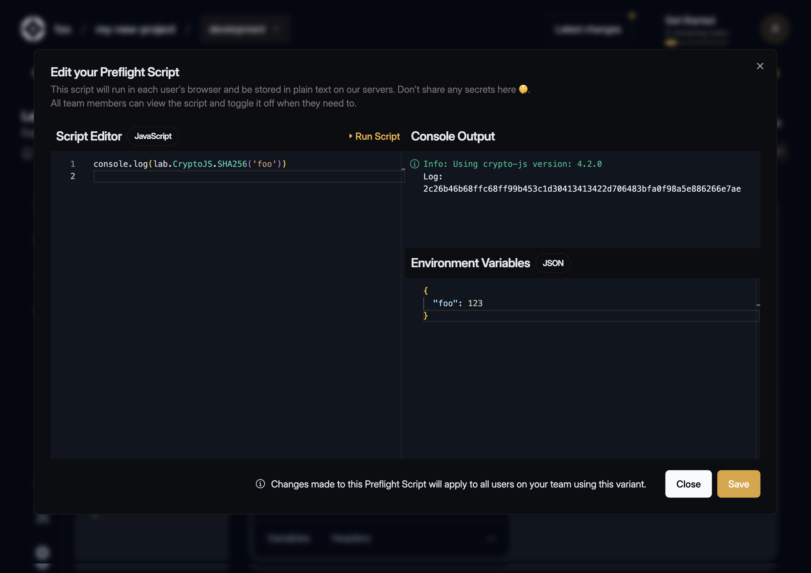
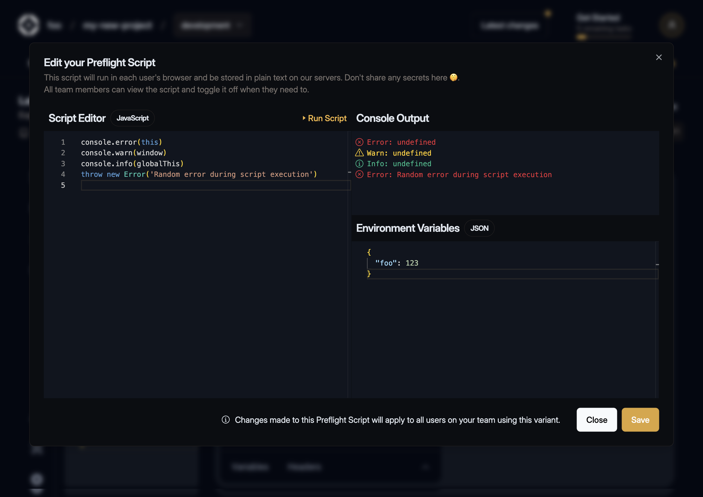

---
description:
  Useful for handling authentication flows like OAuth, where you may need to refresh an access token
---

# Preflight Scripts

import { Callout } from '@theguild/components'
import { Screenshot } from '../../../../components/screenshot'

export const figcaptionClass = 'text-center text-sm mt-2'

**Preflight Scripts** is a feature that enables you to automatically execute custom code before each
GraphQL request is made. They're especially useful for handling authentication flows like OAuth,
where you may need to claim or refresh an access token, validate credentials, or set up custom
headers - all before the request is sent.

## Configuring Preflight Script

Navigate to the sidebar section and click the terminal icon to create a preflight script.

The interface displays two editors:

- a **read-only Script editor** in JavaScript for viewing the saved script,
- an **Environment Variables editor** in JSON that persists data in localStorage.

<Screenshot></Screenshot>

## Editing Preflight Script

Clicking the "Edit" button opens a window that allows you to edit, test, and save your script in
Hive.

<Callout type="warning">
  **Note**: Your script will stored as plain text in our database, don't put any secrets there, use
  Environment variables editor for it! The preflight script is accessible to all members of your
  organization, but only users with access to target Settings can edit the script code.
</Callout>

You can use any JavaScript syntax (including top-level `await`) in the Script editor. Getting and
setting environment variables is done by accessing the `environment` property on the `lab` global
variable.

```js
// get myKey variable from the Environment variables editor
lab.environment.get('myKey')
// set myKey variable to the Environment variables editor (persistent in localStorage)
lab.environment.set('myKey', myValue)
```

<Screenshot></Screenshot>

### CryptoJS

Additionally, you can access [the CryptoJS library](https://cryptojs.gitbook.io/docs) by accessing
the `CryptoJS` property on the `lab` global variable.

<Screenshot></Screenshot>

### Global Variables and Errors

Access to global variables such as `this`, `window` or `globalThis` is restricted. Errors thrown by
the script will be displayed in Console Output.

<Screenshot></Screenshot>

### Using Environment Variables

To use your environment variables in GraphiQL headers editor wraps environment keys with
double-curly braces, e.g.:

```json filename="Headers" /{{myEnvVar}}/
{
  "Authorization": "Bearer {{myEnvVar}}"
}
```

<Screenshot></Screenshot>
