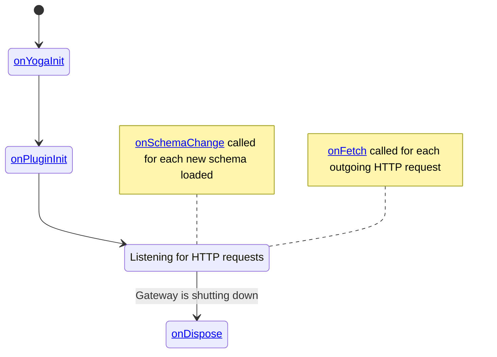

import { Callout } from '@theguild/components'

# Custom Plugins

Hive Gateway is built with an highly modular architecture. The core is as small as possible, and
most of the features are built around a plugin system.

A plugin can hook into each important steps of the lifecycle of the gateway, including the graphql
request execution.

The gateway is built using Graphql Yoga (a GraphQL HTTP server) and Envelop (a GraphQL execution
orchestrator), which are also highly modular technologies. Hive Gateway is extending Yoga and
Envelop plugin system by providing gateway specific hooks.

This means that if a plugin exists in multiple variants, you should follow this priority order:

1.  Hive Gateway: is aware of subgraphs and upstream request management.
2.  Yoga: is aware of the HTTP transport. It most of the time provides optimisations over the
    Envelop variants.
3.  Envelop: is only aware of the GraphQL operation execution.

For example, the Prometheus integration plugin is available for Envelop (`@envelop/prometheus`),
Yoga(`@graphql-yoga/plugin-prometheus`) and Hive Gateway(`@graphql-mesh/prometheus`). In this case,
you should pick `@graphql-mesh/prometheus` plugin. It is built on top of Yoga and Envelop variants,
but adds monitoring capabilities of upstream subgraphs.

For the most used features, you will not have to explicitly setup the dedicated plugin. They will be
added automatically based on your gateway configuration.

## Configuration

You can add plugins to your gateway using the `plugins` option.

It have to be a function, which will be called each time the gateway have update its configuration.
For example, if polling is enabled, this function will be called for each poll.

Most Hive Gateway plugins takes an object as a parameter, and expect some common components like a
`logger`, a `pubsub`, etc... Those components are given in parameters to the `plugins` function. It
is advised to spread the plugin's factory context into the plugins options, this way plugins will
have access to all components they need.

```ts filename="gateway.config.ts"
import { defineConfig } from '@graphql-hive/gateway'
import useNewRelic from '@graphql-mesh/plugin-newrelic'
import { useSOFA } from '@graphql-yoga/plugin-sofa'

export const gatewayConfig = defineConfig({
  plugins: ctx => [
    useSOFA({
      ...ctx,
      basePath: '/rest',
      swaggerUIEndpoint: '/rest/docs'
    }),
    useNewRelic({
      ...ctx
    })
  ]
})
```

## Custom Plugins

You can take advantage of the plugin system to create your own custom plugin. This allows you to
integrate your gateway with any technology that we don't officially support, being public or private
to your company.

A good entry-point for discovering how to write Gateway plugins is to look at the source code of the
existing plugins maintained by us.

A plugin is an object that can define methods to hook into different phases or events of the gateway
lifecycle. Each hook will receive a single parameter, the hook payload, containing data related to
the hooked phase and functions allowing you to modify the behavior of this phase.

There are 2 categories of hooks:

- Gateway lifecycle hooks: they are related to the lifecycle or events of the server itself and is
  not related to a specific request.
- Request lifecycle hooks: they are tight to a specific phase of a specific request. Those hooks
  always give access to the related request in there payload.

### Gateway lifecycle

Gateway lifecycle allows to setup long running services, initialize in-memory cache or stores, react
to general events.



#### `onYogaInit`

It is the very first hook called just before the gateway starts listening for HTTP requests.

You can use this hook to customize the Yoga instance.

| Payload field | Description                                                    |
| ------------- | -------------------------------------------------------------- |
| `yoga`        | `YogaServer` instance that is about to start with the gateway. |

#### `onPluginInit`

Called before the server starts listening to HTTP requests.

In this hook, you can initialize every long running components, such as values stores, cache, third
party clients, etc...

You can add other plugin in this hook, which allow you to ensure plugins you depends on are present.

| Payload field                          | Description                                                                                                                                                                                              |
| -------------------------------------- | -------------------------------------------------------------------------------------------------------------------------------------------------------------------------------------------------------- |
| `addPlugin(plugin: Plugin)`            | Allows adding a plugin to the plugin list. The new plugin will be added just after the one calling this function. It can be called multiple times, preserving plugin order.                              |
| `plugins: Plugin[]`                    | The current list of plugins. It can be used to verify if a dependent plugin is already in the list or to ensure your plugin is not present twice. This should never be mutated; use `addPlugin` instead. |
| `setSchema(schema: GraphQLSchema)`     | Allows replacing the current schema.                                                                                                                                                                     |
| `registerContextErrorHandler(handler)` | Registers a handler that will be called if the GraphQL context factory throws an error. Useful for error reporting.                                                                                      |

#### `onSchemaChange`

This hook is called when the schema changes, either because the Gateway loaded it the first time, or
because a plugin changed it.

Possible usage examples of this hooks are:

- Monitor changes of schemas
- Analyse the schema or keep track of it for other hooks
- Modify the schema

| Payload field   | Description                                                                                                                                                             |
| --------------- | ----------------------------------------------------------------------------------------------------------------------------------------------------------------------- |
| `schema`        | The new loaded schema                                                                                                                                                   |
| `replaceSchema` | Replace the schema. This will trigger a new call to `onSchemaChange`, so you should keep track of schema already modified by your plugin to avoid infinite change loop. |

#### `onFetch`

This hook is called each time the `fetch` function is called. It can be either a request to an
upstream subgraph using the http transport, or a request made a plugin to a third party technology.

This hook has a before and after stage. You can hook into the after phase by returning a function
(see [`onParseDone`](#onfetchdone)).

Possible usage examples of the hooks are:

- Manipulate HTTP [`Request`](https://developer.mozilla.org/en-US/docs/Web/API/Request) object
- Manipulate HTTP [`Response`](https://developer.mozilla.org/en-US/docs/Web/API/Response) object
- Change [`fetch`](https://developer.mozilla.org/en-US/docs/Web/API/Fetch_API) implementation
- Add custom headers
- Monitor the HTTP request

| Payload field      | Description                                                                                                                                                            |
| ------------------ | ---------------------------------------------------------------------------------------------------------------------------------------------------------------------- |
| `url`              | The target URL of the request                                                                                                                                          |
| `setUrl`           | Replace the target URL                                                                                                                                                 |
| `options`          | The `fetch` function options                                                                                                                                           |
| `setOptions`       | Replace the options that will be used to send the request                                                                                                              |
| `info`             | The GraphQL operation info                                                                                                                                             |
| `fetchFn`          | The fetch function that will be used to make the request. By default, it is the one provided in the Gateway configuration if provided, or `@whatwg-node/fetch` if not. |
| `setFetchFn`       | Replace the `fetch` function that will be used to make the request. It should be compatible with standard `fetch` API.                                                 |
| `executionRequest` | Present only if the request is an upstream subgraph request. It contains all information about the upstream query, notably the target subgraph name.                   |
| `requestId`        | A unique ID identifying the client request. This is used to correlate downstream and upstream requests across services.                                                |
| `logger`           | The logger instance for the specific request that includes the details of the request and the response.                                                                |

##### `onFetchDone`

Called once the `fetch` has ended and the response promise has been resolved.

Possible usage examples of the hook are:

- Manipulate HTTP [`Response`](https://developer.mozilla.org/en-US/docs/Web/API/Response) object.
- Monitor the HTTP requests

| Payload Field | Description                                                          |
| ------------- | -------------------------------------------------------------------- |
| `response`    | The response object returned by the fetch call.                      |
| `setResponse` | Function to replace the current response with a new response object. |

#### `onDispose`

In order to clean up resources when Hive Gateway is shut down, you can use `onDispose`,
`Symbol.asyncDispose` or `Symbol.syncDispose` to clean up resources.

[You can learn more about Explicit Resource Management in Yoga documentation](https://the-guild.dev/graphql/yoga-server/docs/features/explicit-resource-management).

### Request Lifecycle

The following diagram shows the lifecycle of request in Hive Gateway.

Each hook is given a single parameter called payload. Please see detail section of each hook to know
what contains each of this payloads.

```mermaid
stateDiagram-v2
  onRequest: <a href="#onrequest">onRequest</a>
  onResponse: <a href="#onresponse">onResponse</a>
  state onRequest_if_state <<choice>>
  onRequest --> onRequest_if_state
  onRequest_if_state --> onResponse: Is not a GraphQL Request
  onRequest_if_state --> onRequestParse: Is GraphQL Request
  onRequestParse: <a href="#onrequestparse">onRequestParse</a>
  onParams: <a href="#onparams">onParams</a>
  onEnveloped: <a href="#onenveloped">onEnveloped</a>
  onParse: <a href="#onparse">onParse</a>
  onParseDone: <a href="#onparsedone">onParseDone</a>
  onValidate: <a href="#onvalidate">onValidate</a>
  onValidateDone: <a href="#onvalidatedone">onValidateDone</a>
  onContextBuilding: <a href="#oncontextbuilding">onContextBuilding</a>
  onContextBuildingDone: <a href="#oncontextbuildingdone">onContextBuildingDone</a>
  onExecute: <a href="#onexecute">onExecute</a>
  onSubscribe: <a href="#onsubscribe">onSubscribe</a>
  onExecuteDone: <a href="#onexecutedone">onExecuteDone</a>
  onFetch: <a href="#onfetch">onFetch (HTTP only)</a>
  onFetchDone: <a href="#onfetchdone">onFetchDone</a>
  onExecutionResult: <a href="#onexecutionresult">onExecutionResult</a>
  onResultProcess: <a href="#onresultprocess">onResultProcess</a>
  onDelegationPlan: <a href="#ondelegationplan">onDelegationPlan</a>
  onDelegationPlanDone: <a href="#ondelegationplandone">onDelegationPlanDone</a>
  onDelegationStageExecute: <a href="#ondelegationstageexecute">onDelegationStageExecute</a>
  onDelegationStageExecuteDone: <a href="#ondelegationstageexecutedone">onDelegationStageExecuteDone</a>
  onSubgraphExecute: <a href="#onsubgraphexecute">onSubgraphExecute</a>
  onSubgraphExecuteDone: <a href="#onsubgraphexecutedone">onSubgraphExecuteDone</a>

  onRequestParse --> onParams
  onParams --> onEnveloped
  onEnveloped --> onParse
  onParse --> onParseDone
  onParseDone --> onValidate
  onValidate --> onValidateDone
  onValidateDone --> onContextBuilding
  onContextBuilding --> onContextBuildingDone
  onContextBuildingDone --> onExecute: Is query or mutation
  onContextBuildingDone --> onSubscribe: Is subscription

  [*] --> onRequest

  state is_plan_cached <<choice>>
  onExecute --> is_plan_cached
  onSubscribe --> is_plan_cached
  is_plan_cached --> onDelegationPlan: Plan is not cached
  is_plan_cached --> onDelegationStageExecute: Plan is cached

  note left of onDelegationPlan: For each nested selection set of the query
  onDelegationPlan --> onDelegationPlanDone
  onDelegationPlanDone --> onDelegationStageExecute
  onDelegationStageExecute --> onSubgraphExecute
  onSubgraphExecute --> onFetch
  onFetch --> onFetchDone
  onFetchDone --> onSubgraphExecuteDone

  state is_plan_finished <<choice>>
  onSubgraphExecuteDone --> onDelegationStageExecuteDone
  onDelegationStageExecuteDone --> is_plan_finished
  is_plan_finished --> onDelegationStageExecute: Plan execution not finished

  state end_of_execution <<choice>>

  is_plan_finished --> end_of_execution: Plan execution finished

  onSubscriptionResult: <a href="#onsubscriptionresult">onSubscriptionResult</a>
  onSubscriptionError: <a href="#onsubscriptionerror">onSubscriptionError</a>
  end_of_execution --> onSubscriptionResult: Is subscription
  onSubscriptionResult --> onExecutionResult
  onSubscriptionResult --> onSubscriptionError: First exception thrown when resolving a subscription result

  end_of_execution --> onExecuteDone: Is query or mutation
  onExecuteDone --> onExecutionResult

  onNext: <a href="#onnext">onNext</a>
  onEnd: <a href="#onend">onEnd</a>
  onExecutionResult --> onNext: Is AsyncIterable (subscription, defer, stream)
  note left of onNext: For each incremental result
  onNext --> onEnd

  onExecutionResult --> onResultProcess

  onResultProcess --> onResponse
  onResponse --> [*]
```



#### `onRequest`

This hook is invoked for ANY incoming HTTP request. Here you can manipulate the request or create a
short circuit before Yoga handles the request.

<Callout type="warning">

Exceptions thrown by this hook are not caught. This means they will buble up to the HTTP server
underlying implementation.

For example, the `node:http` server crashes the entire process on uncaught exceptions.

Prefer `onRequestParse` when possible, or wrap the hook code in a `try` block.

</Callout>

For example, you can shortcut the manually handle an HTTP request, short-circuiting the Hive Gateway
HTTP handler:

```ts
import type { GatewayPlugin } from '@graphql-hive/gateway'

function useAuth(): GatewayPlugin {
  return {
    onRequest({ request, fetchAPI, endResponse }) {
      if (!request.headers.get('authorization')) {
        endResponse(
          new fetchAPI.Response(null, {
            status: 401,
            headers: {
              'Content-Type': 'application/json'
            }
          })
        )
      }
    }
  }
}
```

Possible usage examples of this hook are:

- Manipulate the request
- Short circuit before Yoga handles the request

| Payload field   | Description                                                                                                                                     |
| --------------- | ----------------------------------------------------------------------------------------------------------------------------------------------- |
| `request`       | The incoming HTTP request as WHATWG `Request` object. [Learn more about the request](https://developer.mozilla.org/en-US/docs/Web/API/Request). |
| `serverContext` | The early context object that is shared between all hooks and the GraphQL execution. [Learn more about the context](/docs/features/context).    |
| `fetchAPI`      | WHATWG Fetch API implementation. [Learn more about the fetch API](https://developer.mozilla.org/en-US/docs/Web/API/Fetch_API).                  |
| `url`           | WHATWG URL object of the incoming request. [Learn more about the URL object](https://developer.mozilla.org/en-US/docs/Web/API/URL).             |
| `endResponse`   | A function that allows you to end the request early and send a response to the client.                                                          |

#### `onRequestParse`

This hook is invoked for any incoming GraphQL HTTP request and is invoked before attempting to parse
the GraphQL parameters. Here you can manipulate the request, set a custom request parser or apply
security measures such as checking for access tokens etc.

Possible usage examples of this hook are:

- Manipulate the request
- Set custom GraphQL request parser (use custom GraphQL protocol)
- Apply security measures

| Payload field      | Description                                                                                                                                     |
| ------------------ | ----------------------------------------------------------------------------------------------------------------------------------------------- |
| `request`          | The incoming HTTP request as WHATWG `Request` object. [Learn more about the request](https://developer.mozilla.org/en-US/docs/Web/API/Request). |
| `url`              | The incoming HTTP request target url                                                                                                            |
| `requestParser`    | The function that will be used to extract GraphQL params from the request.                                                                      |
| `setRequestParser` | Allows to replace the function that will be used to extract GraphQL params from the request                                                     |

#### `onParams`

This hook is invoked for an incoming GraphQL request after the GraphQL parameters (`query`,
`variables`, `extensions` and `operationName`) have been ATTEMPTED to be parsed.

Within this hook you can manipulate and customize the parameters or even implement a whole new way
of parsing the parameters (if you wish to diverge from the GraphQL over HTTP specification).

In addition to that you could also short-circuit and skip the GraphQL execution. E.g. you might want
to serve a result from the cache instead.

Possible usage examples of this hook are:

- **[Response Cache](/docs/features/response-caching)**: Short-circuit GraphQL execution if response
  can be served from the cache.
- **[Persisted Operations](/docs/features/persisted-operations):** Load the `query` document string
  from the persisted operations store before running the execution.
- **[APQ](/docs/features/automatic-persisted-queries):** Load/persist the `query` document string on
  the persisted operations store.

| Payload field | Description                                                                                                                                                                                                      |
| ------------- | ---------------------------------------------------------------------------------------------------------------------------------------------------------------------------------------------------------------- |
| `request`     | The incoming HTTP request as WHATWG `Request` object. [Learn more about the request](https://developer.mozilla.org/en-US/docs/Web/API/Request).                                                                  |
| `params`      | The `GraphQLParams` extracted from the request.                                                                                                                                                                  |
| `setParams`   | Allows to replace the `GraphQLParams` for this request                                                                                                                                                           |
| fetchAPI      | [Fetch API](https://developer.mozilla.org/en-US/docs/Web/API/Fetch_API) provided in the Hive Gateway configuration. This should be used to make outgoing HTTP request, since it will trigger the `onFetch` hook. |
| `context`     | The server context. It can contain runtime specific data, such as `req` and `res` object when running in Node for example.                                                                                       |

#### `onEnveloped`

This hook is called once per operation, at the start of the GraphQL execution pipeline. This is
useful if you need to do some setup right before an incoming execution flow.

| Payload Field   | Description                                                |
| --------------- | ---------------------------------------------------------- |
| `setSchema`     | Sets the schema to be used.                                |
| `context`       | The GraphQL context object.                                |
| `extendContext` | Extends the GraphQL context object with additional fields. |

#### `onParse`

Called for parsing the GraphQL document. This hook has a before and after stage. You can hook into
the after phase by returning a function (see [`onParseDone`](#onparsedone)).

**Example actions in this hook:**

- Replace GraphQL parser and support future GraphQL syntax
- Collect metrics about parsing success/failures

| Payload Field       | Description                                                                                             |
| ------------------- | ------------------------------------------------------------------------------------------------------- |
| `context`           | The current context object.                                                                             |
| `extendContext`     | Extend the context object with a partial.                                                               |
| `params`            | The parameters that are passed to the parse call.                                                       |
| `parseFn`           | The current parse function.                                                                             |
| `setParseFn`        | Replace the current parse function.                                                                     |
| `setParsedDocument` | Set/overwrite the parsed document. If a parsed document is set the call to the parseFn will be skipped. |

##### `onParseDone`

You can return a function from `onParse` to register a hook called after the parsing of the GraphQL
document.

**Example actions in this hook:**

- Modify the parsed document
- Gather metadata from the document, like directives.

| Field Name           | Description                                       |
| -------------------- | ------------------------------------------------- |
| `context`            | The GraphQL context object.                       |
| `extendContext`      | Extend the GraphQL context object with a partial. |
| `result`             | The result of the parse phase.                    |
| `replaceParseResult` | Replace the parse result with a new result.       |

#### `onValidate`

Called for validating the GraphQL document. This hook has a before and after stage. You can hook
into the after phase by returning a function (see [`onValidateDone`](#onvalidatedone))

**Example actions in this hook:**

- Register additional validation rules (e.g. [Disable Introspection](/docs/features/introspection))
- Collect metrics about validation success/failures

| Payload field       | Description                                                               |
| ------------------- | ------------------------------------------------------------------------- |
| `context`           | The current context object.                                               |
| `extendContext`     | Extend the context object with a partial.                                 |
| `params`            | The parameters with which the validate function will be invoked.          |
| `addValidationRule` | Register a validation rule that will be used for the validate invocation. |
| `validateFn`        | The current validate function that will be invoked.                       |
| `setValidationFn`   | Overwrite the current validate function.                                  |
| `setResult`         | Set a validation error result and skip the validate invocation.           |

##### `onValidateDone`

You can return a function from `onValidate` to register a hook called after the validation of the
GraphQL operation.

**Example actions in this hook:**

- Replace the validation result
- Collect metrics and validation errors

| Field Name      | Description                                                      |
| --------------- | ---------------------------------------------------------------- |
| `context`       | The current context object.                                      |
| `extendContext` | Extend the context object with a partial.                        |
| `valid`         | Whether the validation raised any errors or not.                 |
| `result`        | An array of errors that were raised during the validation phase. |
| `setResult`     | Replace the current error result with a new one.                 |

#### `onContextBuilding`

Called for building the GraphQL context. This hook has a before and after stage. You can hook into
the after phase by returning a function (see [`onValidateDone`](#oncontextbuildingdone))

**Example actions in this hook:**

- Authentication
- Add data to context object (e.g. user data or dataloader instances)

| Payload field          | Description                                          |
| ---------------------- | ---------------------------------------------------- |
| `context`              | The current GraphQL context object.                  |
| `extendContext`        | Extend the context object with a partial.            |
| `breakContextBuilding` | Prevent calls on any further context building hooks. |

##### `onContextBuildingDone`

You can return a function from `onValidate` to register a hook called after the construction of the
GraphQL context.

**Example actions in this hook:**

- Modify the context

| Field Name      | Description                                       |
| --------------- | ------------------------------------------------- |
| `context`       | The GraphQL context object.                       |
| `extendContext` | Extend the GraphQL context object with a partial. |

#### `onExecute`

Called for executing a GraphQL mutation or query operation.

This hook has a before and after stage. You can hook into before and after the GraphQL request is
executed by returning an object containing an `onExecuteDone` method (see
[`onExecuteDone`](#onexecutedone)).

**Example actions in this hook:**

- Collect metrics about execution time
- Error logging/reporting

| Payload field               | Description                                                    |
| --------------------------- | -------------------------------------------------------------- |
| `executeFn`                 | Current execute function that will be used for execution.      |
| `args`                      | Arguments the execute function will be invoked with.           |
| `setExecuteFn`              | Replace the current execute function with a new one.           |
| `setResultAndStopExecution` | Set an execution result and skip calling the execute function. |
| `extendContext`             | Extend the context object with a partial.                      |

##### `onExecuteDone`

To register this hook, you need to return an object from `onExecute` hook.

If the result is an `AsyncIterable`, you can hook into incremental result delivery by returning an
object with `onNext` and `onEnd` methods (see
[`AsyncIterable` results hooks](#asynciterable-results)).

```ts filename="my-plugin.ts"
const useMyPlugin() = () => ({
  onExecute: () => ({
    onExecuteDone: payload => {
      // handle the end of the execution here
    }
  })
})
```

This plugin is called once the execution is step is finished and a result has been computed.

**Example actions in this hook:**

- Error logging/reporting
- Result modification

| Payload Field | Description                                                                                                                                     |
| ------------- | ----------------------------------------------------------------------------------------------------------------------------------------------- |
| `args`        | The execution arguments.                                                                                                                        |
| `result`      | The execution result returned from the execute function. Can return an AsyncIterable if a graphql.js that has defer/stream implemented is used. |
| `setResult`   | Replace the execution result with a new execution result.                                                                                       |

#### `onSubscribe`

Called for subscribing to a GraphQL subscription operation. This hook has a before and after stage.
You can hook into before and after the GraphQL subscription is executed.

**Example actions in this hook:**

- Collect metrics about execution time
- Error logging/reporting

| Payload field               | Description                                                                                              |
| --------------------------- | -------------------------------------------------------------------------------------------------------- |
| `subscribeFn`               | Current subscribe function that will be used for setting up the subscription.                            |
| `args`                      | Current arguments with which the subscribe function will be invoked.                                     |
| `setSubscribeFn`            | Replace the current subscribe function with a new one that will be used for setting up the subscription. |
| `extendContext`             | Extend the context object with a partial.                                                                |
| `setResultAndStopExecution` | Set a subscribe result and skip calling the subscribe function.                                          |

##### `onSubscriptionResult`

Called when the `AsyncIterable` result have been created and is ready to produce incremental
results.

It is possible to hook into the delivery of each incremental result and the end of the stream by
returning an object with `onNext` and `onEnd` methods (see
[`AsyncIterable` results](#asynciterable-results))

| Payload Field | Description                                                       |
| ------------- | ----------------------------------------------------------------- |
| `args`        | The execution arguments.                                          |
| `result`      | The current incremental execution result.                         |
| `setResult`   | Replace the current execution result with a new execution result. |

##### `onSubscriptionError`

Called for the first exception thrown by the `AsyncIterable`.

| Payload Field | Description                    |
| ------------- | ------------------------------ |
| `error`       | The error that was thrown.     |
| `setError`    | Function to replace the error. |

#### `AsyncIterable` results

When a result is an `AsyncIterable` (which happens when using `defer`, `stream` or subscriptions),
it is possible to hook into the delivery of each intermediate results and the end of the stream.

To hook into those phases, return an object with `onNext` and/or `onEnd` methods from
[`onExecuteDone`](#onexecutedone) or [`onSubscriptionResult`](#onsubscriptionresult) hooks.

```ts filename="plugin.ts"
export const useMyPlugin = () => ({
  // For queries and mutations (defer and stream)
  onExecute: () => ({
    onExecuteDone: () => ({
      onNext: () => ...,
      onEnd: () => ...,
    })
  })

  // For subscriptions
  onSubscribe: () => ({
    onSubscriptionResult: () => ({
      onNext: () => ...,
      onEnd: () => ...,
    })
  })
})
```

##### `onNext`

This hook is called each time a new intermediate result is produced by the `AsyncIterable`, before
it is sent to the client.

| Field Name  | Description                                               |
| ----------- | --------------------------------------------------------- |
| `args`      | The execution arguments.                                  |
| `result`    | The execution result.                                     |
| `setResult` | Replace the execution result with a new execution result. |

##### `onEnd`

This hook is called at when the `AsyncIterable` has ended, just before notifying the client.

There is no payload provided for this hook. It is advised to use the payload of `onExecuteDone` or
`onSubscriptionResult` to have access to the GraphQL context or other data related to the request.

#### `onDelegationPlan`

Called each time a delegation plan is calculated for a query. It is called for each nested selection
set level of the query.

This hook is not called for each queries, because the plan is cached. This means it will be called
only the first time a query document is encountered since the last schema change.

This hook has a before and after stage. You can return a function to hook into the after stage (see
[`onDelegationPlanDone`](#ondelegationplandone)).

This hook is mostly used for monitoring and tracing purposes.

| Field Name                 | Description                                                                                                             |
| -------------------------- | ----------------------------------------------------------------------------------------------------------------------- |
| `supergraph`               | The GraphQL schema of the supergraph.                                                                                   |
| `subgraph`                 | The name of the subgraph.                                                                                               |
| `sourceSubschema`          | The schema of the subgraph.                                                                                             |
| `typeName`                 | The name of the type being planed.                                                                                      |
| `variables`                | The variables provided in the client request.                                                                           |
| `fragments`                | The fragments provided in the client request.                                                                           |
| `fieldNodes`               | The field nodes of selection set being planned.                                                                         |
| `context`                  | The GraphQL context object.                                                                                             |
| `requestId`                | A unique ID identifying the client request. This is used to correlate downstream and upstream requests across services. |
| `logger`                   | The logger instance for the specific request that includes the details of the request and the response.                 |
| `info`                     | The `GraphQLResolveInfo` object of the client query.                                                                    |
| `delegationPlanBuilder`    | The delegation plan builder.                                                                                            |
| `setDelegationPlanBuilder` | Function to replace the current delegation plan builder.                                                                |

##### `onDelegationPlanDone`

Called when a delegation plan has been calculated.

This hook is mostly used for monitoring and tracing purpose.

| Payload Field       | Description                                                                 |
| ------------------- | --------------------------------------------------------------------------- |
| `delegationPlan`    | The delegation plan calculated.                                             |
| `setDelegationPlan` | Function to replace the current delegation plan with a new delegation plan. |

#### `onDelegationStageExecute`

Called when a delegation plan stage is executed. This can be called multiple times for a query if it
requires multiple stages to be fully resolved.

This hooks has a before and after stage. You can return a function to hook into the after stage (see
[`onDelegationStageExecuteDone`](#ondelegationstageexecutedone)).

| Payload Field  | Description                                                                                                             |
| -------------- | ----------------------------------------------------------------------------------------------------------------------- |
| `object`       | The object being resolved.                                                                                              |
| `context`      | The GraphQL context object.                                                                                             |
| `info`         | The `GraphQLResolveInfo` object.                                                                                        |
| `subgraph`     | The name of the subgraph.                                                                                               |
| `subschema`    | The schema of the current subgraph.                                                                                     |
| `selectionSet` | The selection set node that will be queried.                                                                            |
| `key`          | The key for the entity being resolved.                                                                                  |
| `type`         | The type of the entity being resolved.                                                                                  |
| `typeName`     | The name of the type being resolved.                                                                                    |
| `resolver`     | The resolver function for the merged type.                                                                              |
| `setResolver`  | Function to set a new resolver for the merged type.                                                                     |
| `requestId`    | A unique ID identifying the client request. This is used to correlate downstream and upstream requests across services. |
| `logger`       | The logger instance for the specific request that includes the details of the request and the response.                 |

##### `onDelegationStageExecuteDone`

Called when the delegation plan has been executed and all subgraph queries have been done for the
current stage.

| Field Name  | Description                             |
| ----------- | --------------------------------------- |
| `result`    | The result of the delegation execution. |
| `setResult` | Function to replace the result.         |

#### `onSubgraphExecute`

This hook is invoked for ANY request that is sent to the subgraph.

**Example actions in this hook:**

- Manipulate the request
- Add a custom auth header
- Monitor the subgraph request

You can see [Prometheus plugin](/docs/gateway/authorization-authentication) for an example of how to
use this hook.

| Payload Field         | Description                                                                                             |
| --------------------- | ------------------------------------------------------------------------------------------------------- |
| `subgraph`            | The GraphQL schema of the subgraph.                                                                     |
| `subgraphName`        | The name of the subgraph.                                                                               |
| `transportEntry`      | The transport entry that will be used to resolve queries for this subgraph                              |
| `executionRequest`    | The execution request object containing details of the upstream GraphQL operation.                      |
| `setExecutionRequest` | Function to replace the current execution request.                                                      |
| `executor`            | The executor function used to execute the upstream request.                                             |
| `setExecutor`         | Function to replace the current executor.                                                               |
| `requestId`           | A unique ID identifying the client request.                                                             |
| `logger`              | The logger instance for the specific request that includes the details of the request and the response. |

##### `onSubgraphExecuteDone`

Called when the subgraph execution is done and a result has been received.

| Payload Field | Description                                                                                                     |
| ------------- | --------------------------------------------------------------------------------------------------------------- |
| `result`      | The result of the subgraph execution, which can be an `ExecutionResult` or an `AsyncIterable<ExecutionResult>`. |
| `setResult`   | Function to replace the result.                                                                                 |

#### `onExecutionResult`

This hook is invoked for each result produced for GraphQL operation, before it is processed to be
sent to client.

In particular, it is useful to handle batched operations. If a request contains batched operations,
this hook is called once of each operation, while `onResultProcess` will be only called once for the
entire request.

Here, you can modify the result, to add monitoring or instrumentation extensions for example.

**Example actions in this hook:**

- Add metadata to results
- Collect errors

| Payload field | Description                                                                                                                                     |
| ------------- | ----------------------------------------------------------------------------------------------------------------------------------------------- |
| `request`     | The incoming HTTP request as WHATWG `Request` object. [Learn more about the request](https://developer.mozilla.org/en-US/docs/Web/API/Request). |
| `result`      | The execution result, which can be an `ExecutionResultWithSerializer`, an `AsyncIterable<ExecutionResultWithSerializer>`.                       |
| `setResult`   | Allows to replace the execution result.                                                                                                         |
| `context`     | The GraphQL context.                                                                                                                            |

#### `onResultProcess`

This hook is invoked after a GraphQL request has been processed and before the response is forwarded
to the client. Here you can customize what transport/response processor format should be used for
sending the result over the wire.

**Example actions in this hook:**

- Specify custom response format
- Logging/Metrics

| Field Name             | Description                                                                                                                                                                            |
| ---------------------- | -------------------------------------------------------------------------------------------------------------------------------------------------------------------------------------- |
| `request`              | The incoming HTTP request as WHATWG [`Request`](https://developer.mozilla.org/en-US/docs/Web/API/Request) object.                                                                      |
| `result`               | The execution result, which can be an `ExecutionResultWithSerializer`, an `AsyncIterable<ExecutionResultWithSerializer>`. If the request contains batch queries, this will be an array |
| `setResult`            | Allows to replace the execution result.                                                                                                                                                |
| `resultProcessor`      | The result processor to be used to turn the result into an HTTP [`Response`](https://developer.mozilla.org/en-US/docs/Web/API/Request) object.                                         |
| `acceptableMediaTypes` | List of acceptable media types for the result processor.                                                                                                                               |
| `setResultProcessor`   | Allows to set the result processor and the accepted media type.                                                                                                                        |
| `serverContext`        | The server context which can contain runtime specific data, such as for example `req` and `res` object when running in Node                                                            |

#### `onResponse`

This hook is invoked after a HTTP request (both GraphQL and NON GraphQL) has been processed and
after the response has been forwarded to the client. Here you can perform any cleanup or logging
operations, or you can manipulate the outgoing response object.

<Callout type="warning">

Exceptions thrown by this hook are not caught. This means they will buble up to the HTTP server
underlying implementation.

For example, the `node:http` server crashes the entire process on uncaught exceptions.

Prefer `onRequestParse` when possible, or wrap the hook code in a `try` block.

</Callout>

**Example actions in this hook:**

- Specify custom response format
- Logging/Metrics

| Field Name      | Description                                                                                                                                                   |
| --------------- | ------------------------------------------------------------------------------------------------------------------------------------------------------------- |
| `request`       | The incoming HTTP request as WHATWG `Request` object. [Learn more about the request](https://developer.mozilla.org/en-US/docs/Web/API/Request).               |
| `serverContext` | The final context object that is shared between all hooks and the GraphQL execution. [Learn more about the context](/docs/features/context).                  |
| `response`      | The outgoing HTTP response as WHATWG `Response` object. [Learn more about the response interface](https://developer.mozilla.org/en-US/docs/Web/API/Response). |

### Plugin Context

Hive Gateway comes with ready-to-use `logger`, `fetch`, cache storage and etc that are shared across
different components. We'd highly recommend you to use those available context values instead of
creating your own for a specific plugin.

```ts filename="gateway.config.ts"
import { defineConfig } from '@graphql-hive/gateway'

export const gatewayConfig = defineConfig({
  plugins({
    fetch, // WHATWG compatible Fetch implementation.
    logger, // Logger instance used by Hive Gateway
    cwd, // Current working directory
    pubsub, // PubSub instance used by Hive Gateway
    cache // Cache storage used by Hive Gateway
  }) {
    return [
      useMyPlugin({ logger, fetch }) // So the plugin can use the shared logger and fetch
    ]
  }
})
```
