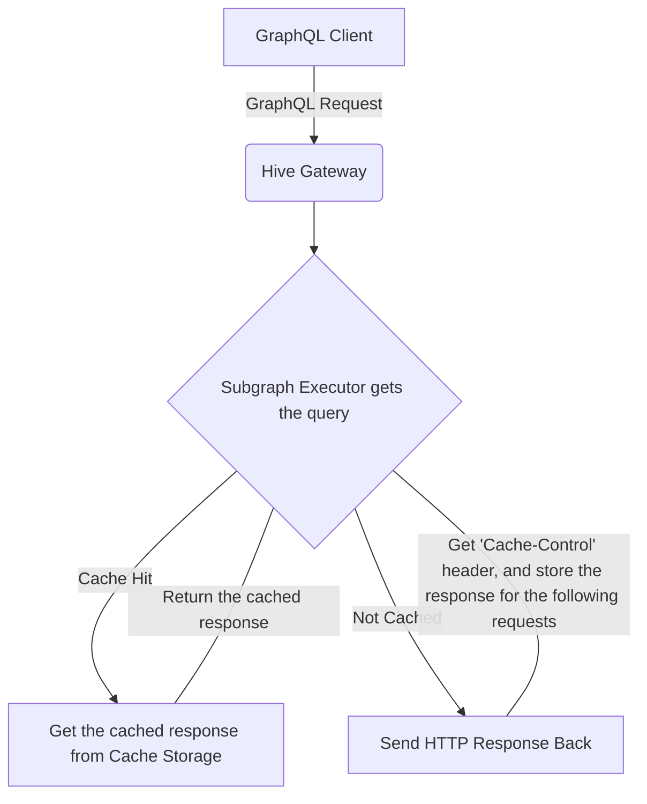
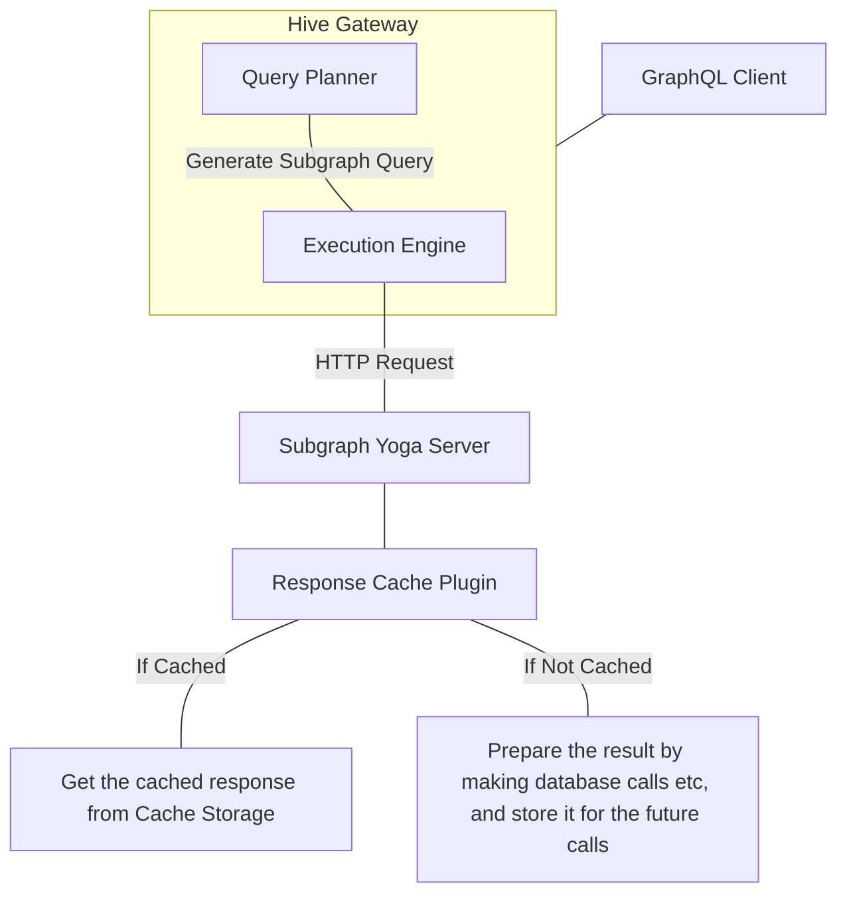
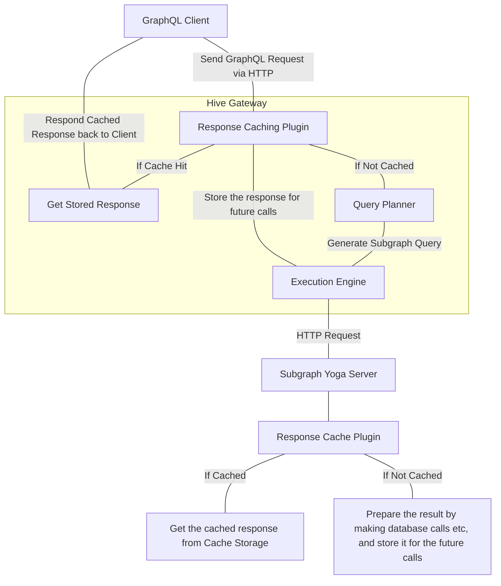

import { Code } from 'nextra/components'
import { Callout, Tabs } from '@theguild/components'

# Response Caching

**_GraphQL Response Caching_** is a feature that allows you to cache the response of a GraphQL
query. This is useful when you want to reduce the number of requests to your sources. For example,
if you have a GraphQL query that fetches a list of products, you can cache the response of this
query so that the next time the same query is made, the response is fetched from the cache instead
of making a request to the underlying sources.

<Callout>
  You need to set your cache storage in your gateway configuration to enable response caching. See
  [Cache Storage](/docs/gateway/other-features/performance#providing-cache-storage) for more
  information.
</Callout>

## How to use?

```ts filename="gateway.config.ts"
import { defineConfig } from '@graphql-hive/gateway'

export const gatewayConfig = defineConfig({
  responseCaching: {
    // global cache
    session: () => null
  }
})
```

After starting the server we can execute a GraphQL Query operation, that selects the `Query.slow`
field.

```sh filename="Execute slow GraphQL Query Operation with cUrl"
curl -X POST http://localhost:4000/graphql \
  -H 'Content-Type: application/json' \
  -d '{ "query" : "{ slow }" }' \
  -w '\nTotal time : %{time_total}'
```

The output will look similar to the following:

```sh filename="Initial Request time"
{"data":{"slow":"I am slow."}}
Total time:5.026632
```

After executing the same curl statement a second time, the duration is significantly lower.

```sh filename="Cached Request time"
{"data":{"slow":"I am slow."}}
Total time:0.007571%
```

## Configuration

The behaviour of this plugin can be configured by passing an object at the gateway level or by using
`@cacheControl` directive at schema defintion level.

The `@cacheControl` directive can be used to give to subgraphs the control over the cache behavior
for the fields and types they are defining. You can add this directive during composition.

You can learn more about the behavior of the `@cacheControl` directive in the following section. If
you want to use the configuration API on the gateway, you can skip the `@cacheControl` directive
section.

### `@cacheControl` directive's behavior

This directive allows you to control response caching from the subgraph. But the behavior can be
different depending on the subgraph configuration.

The following 3 section shows the ways of using the `@cacheControl` directive in different ways. The
usage examples in the other sections represent the third(last) use case in the following three.

#### Apollo Server with `Cache-Control` header (This response cache plugin is not required)

Apollo Server handles `@cacheControl` directives to set HTTP caching headers in the HTTP response to
the gateway. Then the gateway can cache the response based on these headers.
[Learn more about Apollo Server's cache control behavior](https://www.apollographql.com/docs/apollo-server/performance/caching).
In this case, gateway is still response of caching the response. Hive Gateway can handle http
caching headers using [HTTP Caching plugin](/docs/gateway/other-features/performance/http-caching).



##### Example

Let's say you have a subgraph that defines a `Post` type with a `@cacheControl` directive, your Hive
Gateway has [HTTP Caching plugin](/docs/gateway/other-features/performance/http-caching) enabled.

```graphql
type Post @cacheControl(maxAge: 240) {
  id: Int!
  title: String
}
```

When the gateway receives a query that selects the `Post` type, it will cache the response for 240
seconds.

```graphql
query {
  posts {
    id
    title
  }
}
```

In this case, the gateway will cache the response for 240 seconds. If the same query is made within
240 seconds, the gateway will return the cached response.

#### GraphQL Yoga with the response caching plugin (This response cache plugin is not required)

On the other hand, GraphQL Yoga handles `@cacheControl` directives to configure the response caching
behavior rather than `Cache-Control` headers like Apollo Server. It leverages `ETag` headers to
cache the response and invalidate it by mutations.
[Learn more about GraphQL Yoga's response caching behavior](https://the-guild.dev/graphql/yoga-server/docs/features/response-caching).
So even if nothing is configured on the gateway but Yoga on the subgraph uses the response caching
plugin on its own. But this won't reduce the HTTP connection traffic in between gateway and
subgraph.



##### Example

Let's say you have a subgraph that defines a `Post` type with a `@cacheControl` directive, your Hive
Gateway has [HTTP Caching plugin](/docs/gateway/other-features/performance/http-caching) enabled.

```graphql
type Post @cacheControl(maxAge: 240) {
  id: Int!
  title: String
}
```

When the gateway receives a query that selects the `Post` type, it will forward the request to the
subgraph directly.

```graphql
query {
  posts {
    id
    title
  }
}
```

Then Yoga Server will generate the response and cache it for 240 seconds. If the same query is made
within 240 seconds, Yoga Server will return the cached response. So it will always receive the HTTP
request but do the less work to generate the response. The difference between others, this case
won't reduce the HTTP connection traffic in between gateway and subgraph, but it will reduce the
work that subgraph needs to do to generate the response.

#### Subgraphs with any server implementation using directives directly (This response cache plugin is required)

Besides these two, you can let the gateway handle the caching on its own. In this case, you need to
define the following in the subgraphs so the supergraph has `@cacheControl` directives. Then, the
response caching plugin on the gateway will handle the caching based on these directives.

```graphql
extend schema
  @link(
    # Federation spec version should be at least 2.1 to support `@composeDirective`
    url: "https://specs.apollo.dev/federation/v2.1"
    import: ["@composeDirective"]
  )
  # Import `@cacheControl`
  @link(url: "https://the-guild.dev/mesh/v1.0", import: ["@cacheControl"])
  # Use `@composeDirective` to define the directive as exposed
  @composeDirective(name: "@cacheControl")

# Then add the actual directive definitions
enum CacheControlScope {
  PUBLIC
  PRIVATE
}

directive @cacheControl(
  maxAge: Int
  scope: CacheControlScope
  inheritMaxAge: Boolean
) on FIELD_DEFINITION | OBJECT | INTERFACE | UNION
```

In this case, the gateway will cache the response based on the `@cacheControl` directives defined in
the subgraphs.

The difference between the two is that the gateway will control the caching behavior based on the
`@cacheControl` directives defined in the subgraphs. For any cached responses, the gateway will skip
query planning and federation execution phase, and return the response directly.



#### Overall comparison

| Usage of `@cacheControl`                                                                                                                                                                                                                                                                             | No HTTP Calls for cached results                                                                                                                                                                                                                      | Invalidation via mutations                                                                                                                 |     |     |
| ---------------------------------------------------------------------------------------------------------------------------------------------------------------------------------------------------------------------------------------------------------------------------------------------------- | ----------------------------------------------------------------------------------------------------------------------------------------------------------------------------------------------------------------------------------------------------- | ------------------------------------------------------------------------------------------------------------------------------------------ | --- | --- |
| Subgraph on [Apollo Server with Response Cache Plugin](https://www.apollographql.com/docs/apollo-server/performance/caching/)<br/><br/>Uses HTTP `Cache-Control` header & [Gateway HTTP Cache Plugin](/docs/gateway/other-features/performance/http-caching)                                         | 🟢 - Fully done<br/>Until TTL expires given in `Cache-Control` HTTP header, no HTTP calls are made in the following GraphQL requests.<br/>So the number of HTTP requests reduce.                                                                      | 🔴 - Not available<br/>Until TTL expires or cache is reset manually on the gateway,<br/>it is not possible to invalidate it automatically. |     |     |
| Subgraph on [Yoga Server with Response Cache Plugin](https://the-guild.dev/graphql/yoga-server/docs/features/response-caching#http-caching-via-etag-and-if-none-match-headers)<br/><br/>Uses HTTP `ETag` header & [Gateway HTTP Cache Plugin](/docs/gateway/other-features/performance/http-caching) | 🟠 - Partially done<br/>Until TTL expires, it validates via an HTTP request with held `ETag` value on each GraphQL request, <br/>and returns 304 without body.<br/>So the number of HTTP requests do not reduce, but the load in the traffic reduces. | 🟢 - Fully done<br/><br/>In case of fetched new value, ETag value changes so that the gateway can invalidate the cached response           |     |     |
| `@cacheControl` with `@composeDirective`<br/><br/>Uses Gateway Response Caching Plugin                                                                                                                                                                                                               | 🟢 - Fully done<br/>Until TTL expires given in `@cacheControl` directive, no HTTP calls are made in the following GraphQL requests.<br/>So the number of HTTP requests reduce.                                                                        | 🟢 - Fully done<br/>In case of the fetched new value, the cache is directly invalidated by the gateway                                     |     |     |

In order to avoid extra HTTP calls, and invalidate the responses automatically via mutations, it'd
recommended to use the `@cacheControl` directive with the `@composeDirective` in the subgraphs
together with this plugin.

## Session based caching

If your GraphQL API returns specific data depending on the viewer's session, you can use the session
option to cache the response per session. Usually, the session is determined by an HTTP header, e.g.
an user id within the encoded access token.

<Callout type="warning">
  Don't forget to validate the authentication token before using it as a session key.
  Allowing cached responses to be returned with unverified tokens can lead to data leaks.

Please see the [Authorization/Auhtentication](/docs/gateway/authorization-authentication) section
for more information.

</Callout>

```ts filename="gateway.config.ts"
import { defineConfig } from '@graphql-hive/gateway'

export const gatewayConfig = defineConfig({
  responseCaching: {
    // cache based on the authentication header
    session: request => request.headers.get('authentication')
  }
})
```

### Enforce session based caching

In some cases, a type or a field should only be cached if their is a session. For this, you can use
the `scope` to indicate that the cache should only be used if a session is present.

This can be useful to prevent exposure of sensitive data to unauthorized users.

<Tabs items={[
  "Programatically using options",
  <span>Declaratively using <Code>@cacheControl</Code></span>
]}>
  <Tabs.Tab>
    ```ts filename="Response Cache configuration with scope"
      defineConfig({
        responseCaching: {
      // cache based on the authentication header
      session: request => request.headers.get('authentication')

      // You can use configuration object to define the scope
      scopePerSchemaCoordinate: {
        'Query.me': 'PRIVATE', // on a field
        User: 'PRIVATE', // or a type
      }}
      })
    ```

  </Tabs.Tab >
  <Tabs.Tab>
    ```graphql filename="GraphQL schema with @cacheControl directive"
    type Query {
      me: User @cacheControl(scope: PRIVATE)   # on a field
    }

    type User @cacheControl(scope: PRIVATE) {  # on a type
      id: ID!
      name: String!
    }
    ```

  </Tabs.Tab>
</Tabs>

### Group based caching

The `session` option can also be used to cache responses based for a group of users. This can be
useful if data exposed by your API is the same for a group of users sharing the same characteristic.

For example, if data returned by an API is always the same for every users with the same role, you
can use the role as a session key.

```ts filename="Role based caching"
defineConfig({
  responseCaching: {
    session: request => request.headers.get('x-user-role')
  }
})
```

## Time to Live (TTL)

By default, all cached operations are stored indefinitely. This can lead to stale data being
returned.

It is possible to give cached operations a time to live. Either globally, based on
[schema coordinates](https://github.com/graphql/graphql-wg/blob/main/rfcs/SchemaCoordinates.md) or
object types.

If a query operation result contains multiple objects of the same or different types, the lowest TTL
is picked.

<Tabs items={[
  "Programatically using options",
  <span>Declaratively using <Code>@cacheControl</Code></span>
]}>
  <Tabs.Tab>
    ```ts filename="Response Cache configuration with TTL"
    defineConfig({
      responseCaching: {
        session: () => null,
        // by default cache all operations for 2 seconds
        ttl: 2_000,
        ttlPerSchemaCoordinate: {
          // only cache query operations containing User for 500ms
          User: 500
          // cache operations selecting Query.lazy for 10 seconds
          'Query.lazy': 10_000
        }
      }
    })
    ```
  </Tabs.Tab>
  <Tabs.Tab>
    ```graphql filename="GraphQL schema with @cacheControl directive"
    type Query {
      me: User @cacheControl(maxAge: 500)   # only cache query operations containing User for 500ms
    }

    type User @cacheControl(maxAge: 10000) {  # cache operations selecting Query.lazy for 10 seconds
      id: ID!
      name: String!
    }
    ```

  </Tabs.Tab>
</Tabs>

## Control which responses are cached

By default, all successful operations influences the cache.

You can globaly disable caching using the `enabled` option. This can be useful for local
development.

```ts filename="Disabling caching"
defineConfig({
  responseCaching: {
    session: request => null,
    enabled: () => process.env.NODE_ENV !== 'development'
  }
})
```

### Ingore a specific request

You can entirely disable caching (both caching and invalidation) for a specific request by using the
`enabled` option.

Be aware that this means that if the response contains entities that are part of other cached
responses, those responses will not be invalidated.

```ts filename="Disabling caching for a specific request"
defineConfig({
  responseCaching: {
    session: request => null,
    enabled: request => request.headers.get('x-no-cache') !== 'true'
  }
})
```

### Disable caching of specific types and fields

Some types or fields contains data that should never be cached. For example, a field that returns
the current time.

You can disable caching for specific types or fields by setting it's TTL to `0`. This will prevent
the response from being cached, but will not prevent cache invalidation for other entities contained
in the response.

<Tabs items={[
  "Programatically using options",
  <span>Declaratively using <Code>@cacheControl</Code></span>
]}>
  <Tabs.Tab title="Programatically using options">
    ```ts filename="Disabling caching for a specific type"
defineConfig({
  responseCaching: {
      session: request => null,
      ttlPerSchemaCoordinate: {
        // for a entire type
        Date: 0
        // for a specific field
        'Query.time': 0
      }
  }
})
    ```
  </Tabs.Tab>
  <Tabs.Tab title="Declaratively using @cacheControl">
    ```graphql filename="GraphQL schema with @cacheControl directive"
    type Query {
      time: String @cacheControl(maxAge: 0)  # on a field
    }

    type Date @cacheControl(maxAge: 0) {     # on a type
      day: Int!
      month: Int!
      year: Int!
    }
    ```

  </Tabs.Tab>
</Tabs>

## Invalidations via Mutation

When executing a mutation operation the cached query results that contain type entities within the
Mutation result will be automatically be invalidated.

```graphql filename="GraphQL mutation operation"
mutation UpdateUser {
  updateUser(id: 1, newName: "John") {
    __typename
    id
    name
  }
}
```

```json filename="GraphQL operation execution result"
{
  "data": {
    "updateLaunch": {
      "__typename": "User",
      "id": "1",
      "name": "John"
    }
  }
}
```

For the given GraphQL operation and execution result, all cached query results that contain the type
`User` with the id `1` will be invalidated.

This behavior can be disabled by setting the `invalidateViaMutation` option to `false`.

```ts filename="Disabling mutation invalidation"
defineConfig({
  responseCaching: {
    session: request => null,
    invalidateViaMutation: false
  }
})
```

### Entity identity

Automatic cache invalidation works by instpecting the result of each query and mutation operations,
and keeping track of the entities that are part of it.

By default, the identity of entities is based on the `id` field.

You can customize the identity field by setting the `idFields` options.

```ts filename="Customizing entity identity"
defineConfig({
  responseCaching: {
    session: request => null,
    idFields: ['id', 'email']
  }
})
```

```graphql
type User {
  email: String!
  username: String!
  profile: Profile!
}

type Profile {
  id: ID!
  bio: String
  picture: String
}
```

In this example, `User`'s identity will be based on `email` field, and `Profile`'s identity will be
based on `id` field.

## HTTP Caching

Response Caching plugin sends `ETag` headers to the client, and respects `If-None-Match` headers in
the HTTP request.

If the client sends an `If-None-Match` header with the same value as the `ETag` header, the server
will respond with a `304 Not Modified` status code without any content, which allows you to reduce
the server load.

Most of the browsers and some HTTP clients support this behavior, so you can use it to improve the
performance of your frontend application.

[Learn more about `ETag` and `If-None-Match` headers](https://developer.mozilla.org/en-US/docs/Web/HTTP/Headers/ETag).

### Example with `curl`

First we send a request to the GraphQL server, and we can see that the response contains the headers

```bash filename="Get ETag and Last-Modified headers"
curl -H 'Content-Type: application/json' \
  "http://localhost:4000/graphql?query={me{id name}}" -v
```

Then the server will respond a data something the following with the `ETag` and `Last-Modified`
headers:

- `ETag` is the key that is used to identify the cached response.
- `Last-Modified` is used to determine if the cached response is still valid.

```bash filename="Response with ETag and Last-Modified headers"
> GET /graphql?query={me{id,name}} HTTP/1.1
> Host: localhost:4000
> User-Agent: curl/7.68.0
> Accept: application/json
>
* Mark bundle as not supporting multiuse
< HTTP/1.1 200 OK
< access-control-allow-origin: *
< content-length: 130
< content-type: application/json; charset=utf-8
< etag: 2c0ebfe7b2b0273029f2fa23a99d213b56f4838756b3ef7b323c04de1e836be3
< last-modified: Wed Feb 15 2023 15:23:55 GMT+0300 (GMT+03:00)
< Date: Wed, 15 Feb 2023 12:23:55 GMT
< Connection: keep-alive
< Keep-Alive: timeout=5
<

{"data":{"me":{"id":"1","name":"Bob"}}}
```

In the next calls, we can use the `ETag` header as the `If-None-Match` header together with
`Last-Modified` header as `If-Modified-Since` to check if the cached response is still valid.

```bash filename="Use the headers to check if the cached response is still valid"
curl -H "Accept: application/json" \
  -H "If-None-Match: 2c0ebfe7b2b0273029f2fa23a99d213b56f4838756b3ef7b323c04de1e836be3" \
  -H "If-Modified-Since: Wed Feb 15 2023 15:23:55 GMT" \
  "http://localhost:4000/graphql?query=\{me\{id,name\}\}" -v
```

Then the server will return `304: Not Modified` status code with no content.
