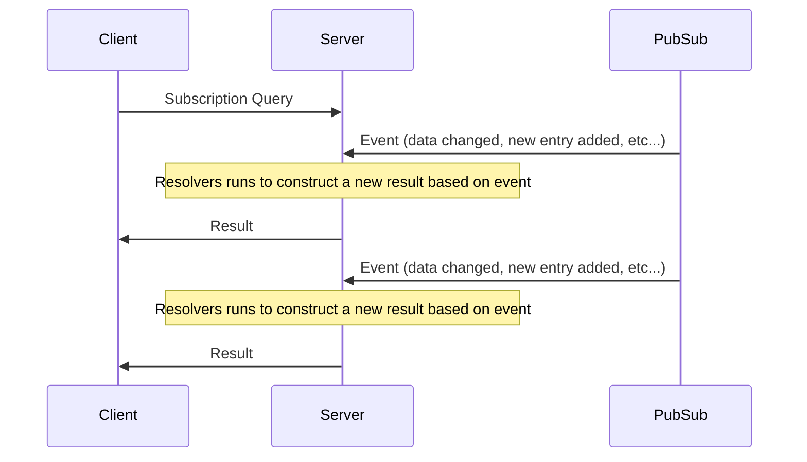
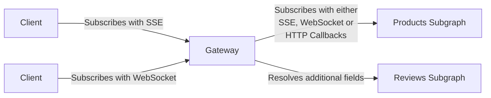

import { Callout, Tabs } from '@theguild/components'

# Subscriptions

Hive Gateway fully supports federated subscriptions and behaves just like
[Federation GraphQL subscriptions in Apollo Router](https://www.apollographql.com/docs/router/executing-operations/subscription-support).

Subgraphs providing subscriptions can communicate with Hive Gateway through one of the following
protocols:

- [GraphQL over SSE](https://github.com/graphql/graphql-over-http/blob/main/rfcs/GraphQLOverSSE.md)
- [GraphQL over WebSocket](https://github.com/graphql/graphql-over-http/blob/main/rfcs/GraphQLOverWebSocket.md)
- [HTTP Callback](https://www.apollographql.com/docs/router/executing-operations/subscription-callback-protocol/)

Clients connecting to the Hive Gateway may use either:

- [GraphQL over SSE](https://github.com/graphql/graphql-over-http/blob/main/rfcs/GraphQLOverSSE.md)
- [GraphQL over WebSocket with `graphql-ws`](https://github.com/enisdenjo/graphql-ws)

## When to use subscriptions

GraphQL subscriptions allows to keep the client updated in real time.

Most of the time, a PubSub system is used to propagate events in the backend system. A client can
use subscriptions to receive those events, augmented with all the data it needs using the GraphQL
ability to resolve additional fields.



Subscriptions can be used for applications that relies on events or live data, such as chats, IoT
sensors, alerting, stock prices, etc...

[Learn more about Subscriptions](https://graphql.org/learn/subscriptions/)

## Subscriptions in Gateways

In the context of a gateway, subscriptions are forwarded from the client to the subgraph
implementing the subscribed field.

With the power of the Gateway, each events received from the upstream subgraph will be augmented
with the requested data from other subgraphs, and then sent to the client.

The Hive Gateway also abstract away the underlying protocol used to transport the data. A client can
use a different transport than the one used to connect with the upstream subgraph.



## Configure subgraph transport

By default, Hive Gateway will always try to use the same transport for queries, mutations and
subscriptions.

In the case of HTTP, the default is to protocol is
[GraphQL over SSE](https://github.com/graphql/graphql-over-http/blob/main/rfcs/GraphQLOverSSE.md).
We highly recommend it, since it's the most performant and idiomatic.

If your subgraph doesn't implement subscriptions over SSE, you can configure Hive Gateway to use
[GraphQL over WebSocket](https://github.com/graphql/graphql-over-http/blob/main/rfcs/GraphQLOverWebSocket.md)
or
[HTTP Callback](https://www.apollographql.com/docs/router/executing-operations/subscription-callback-protocol/).

Whichever protocol is used by Hive Gateway to subscribe to the upstream subgraphs, downstream
clients can subscribe to the gateway using any supported protocol.

### Subscriptions using WebSockets

If your subgraph uses WebSockets for subscriptions support
([like with Apollo Server](https://www.apollographql.com/docs/apollo-server/data/subscriptions/)),
Hive Gateway will need additional configuration pointing to the WebSocket server path on the
subgraph.

Please note that WebSocket for communications between Hive Gateway and subgraphs are suboptimal
compared to other possible transports. We recommend using either SSE or HTTP Callbacks instead.

```ts filename="gateway.config.ts"
import { defineConfig, type WSTransportOptions } from '@graphql-hive/gateway'

export const gatewayConfig = defineConfig({
  supergraph: 'supergraph.graphql',
  transportEntries: {
    // use "*.http" to apply options to all subgraphs with HTTP
    '*.http': {
      options: {
        subscriptions: {
          kind: 'ws',
          // override the path if it is different than normal http
          location: '/subscriptions'
        }
      }
    }
  }
})
```

### Subscriptions using HTTP Callback

If your subgraph uses
[HTTP Callback protocol for subscriptions](https://www.apollographql.com/docs/router/executing-operations/subscription-callback-protocol/),
Hive Gateway will need additional configuration.

```ts filename="gateway.config.ts"
import { defineConfig, type HTTPCallbackTransportOptions } from '@graphql-hive/gateway'

export const gatewayConfig = defineConfig({
  supergraph: 'supergraph.graphql',
  // Setup Hive Gateway to listen for webhook callbacks, and emit the payloads through PubSub engine
  webhooks: true,
  transportEntries: {
    // use "*.http" to apply options to all subgraphs with HTTP
    '*.http': {
      options: {
        subscriptions: {
          kind: 'http-callback',
          options: {
            // The gateway's public URL, which your subgraphs access, must include the path configured on the gateway.
            public_url: 'http://localhost:4000/callback',
            // The path of the router's callback endpoint
            path: '/callback',
            // Heartbeat interval to make sure the subgraph is still alive, and avoid hanging requests
            heartbeat_interval: 5000
          } satisfies HTTPCallbackTransportOptions
        }
      }
    }
  }
})
```

### Subscriptions using mixed protocols

Hive Gateway supports using different transport for different subgraphs. By default, subscriptions
will use the same transport than queries and mutation. This can be change using the
`transportEntries` option.

The key of each entry determine which subgraph will be impacted:

- `*`: all subgraphs
- `*.{transportKind}`: all subgraphs using `transportKind`. For example, `*.http` will impact all
  subgraph using the `http` transport.
- `{subgraphName}`: a specific subgraph.

Configuration are inherited and merged from the least specific to the most specific matcher. Only
exception is the `headers` which is not inherited for the `ws` transport.

For example, let be 4 subgraphs:

- products: using `http` transport for queries, and HTTP callbacks for subscriptions
- views: using `http` transport for queries, and WS for subscriptions
- stocks: using `http` transport for queries, and WS for subscriptions
- stores: using `mysql` transport

```ts filename="gateway.config.ts"
import { defineConfig, type WSTransportOptions } from '@graphql-hive/gateway'

export const gatewayConfig = defineConfig({
  transportEntries: {
    '*.http': {
      // Will be applied to products, views and stocks subgraphs, but not stores.
      options: {
        subscriptions: {
          kind: 'ws',
          options: {
            connectionParams: {
              token: '{context.headers.authorization}'
            }
          } satisfies WSTransportOptions
        }
      }
    },
    products: {
      // Will override the subscriptions configuration for products subgraph only
      options: {
        subscriptions: {
          kind: 'http-callback',
          location: '/subscriptions',
          headers: [['authorization', 'context.headers.authorization']]
        }
      }
    }
  }
})
```

### Propagation of authentication and headers

Hive Gateway can propagate the downstream client's `Authorization` header (or any other header) to
the upstream subgraph.

The propagation of headers is different if you use pure HTTP transports (SSE or HTTP Callbacks) or
WebSockets.

<Tabs items={["HTTP (SSE or Callback)", "WebSocket"]}>

<Tabs.Tab>

Propagation of headers for pure HTTP subscription transports follow the
[same configuration than normal upstream requests](http://localhost:3000/docs/gateway/other-features/header-propagation).

```ts
import { defineConfig } from '@graphql-hive/gateway'

export const gatewayConfig = defineConfig({
  propagateHeaders: {
    fromClientToSubgraphs({ request }) {
      return {
        authorization: request.headers.get('authorization')
      }
    }
  }
})
```

</Tabs.Tab>

<Tabs.Tab>

The recommended way is to use the
[`ConnectionInit` message payload](https://github.com/graphql/graphql-over-http/blob/main/rfcs/GraphQLOverWebSocket.md#connectioninit).
It is also possible, but not recommended, to propagate HTTP headers by sending them alongside the
WebSocket upgrade request.

<Callout type="warning">
  If either `connectionParams` or `headers` are used with dynamic values, it can drastically
  increase the number of upstream WebSockets connections. <br />
  Since `headers` and `connectionParams` can only be applied at connection time, a new connection is
  required for each different set of values provided.
</Callout>

<Tabs items={["ConnectionParams", "HTTP Headers"]}>

<Tabs.Tab>

```ts filename="gateway.config.ts"
import { defineConfig, type WSTransportOptions } from '@graphql-hive/gateway'

export const gatewayConfig = defineConfig({
  supergraph: 'supergraph.graphql',
  transportEntries: {
    // use "*.http" to apply options to all subgraphs with HTTP
    '*.http': {
      options: {
        subscriptions: {
          kind: 'ws',
          location: '/subscriptions',
          options: {
            connectionParams: {
              token: '{context.headers.authorization}'
              // You can also add any other field here.
              // The only limitation is that value must be serializable with JSON.stringify.
            }
          } satisfies WSTransportOptions
        }
      }
    }
  }
})
```

On subgraph side, the contents of the payload will be available in the `graphql-ws` context field
`connectionParams`:

```json
{
  "connectionParams": {
    "token": "<CONTENTS_OF_AUTHORIZATION_HEADER>"
  }
}
```

This is also what Apollo Router do when
[propagating auth on WebSockets](https://www.apollographql.com/docs/router/executing-operations/subscription-support/#websocket-auth-support).

</Tabs.Tab>

<Tabs.Tab>

WebSocket transport does not take in account the `propagateHeaders` option, because they should be
forwarded using `connectionParams`.

It is still possible to forward headers if your subgraph is not compatible with `connectionParams`.

The headers will be sent only with the upgrade request. They will not be sent again during the
lifecycle of the subscription.

```ts filename="gateway.config.ts"
import { defineConfig, type WSTransportOptions } from '@graphql-hive/gateway'

export const gatewayConfig = defineConfig({
  supergraph: 'supergraph.graphql',
  transportEntries: {
    // use "*.http" to apply options to all subgraphs with HTTP
    '*.http': {
      options: {
        subscriptions: {
          kind: 'ws',
          location: '/subscriptions',
          headers: [
            ['authorization', '{context.headers.authorization}']
            // You can also add any other header here.
          ]
        }
      }
    }
  }
})
```

</Tabs.Tab>

</Tabs>

</Tabs.Tab>

</Tabs>

## Configure Client subscriptions

Client subscriptions are enabled by default and compatible with both
[GraphQL over SSE](https://github.com/graphql/graphql-over-http/blob/main/rfcs/GraphQLOverSSE.md)
and [GraphQL over WebSocket with `graphql-ws`](https://github.com/enisdenjo/graphql-ws).

The default endpoint for subscriptions is `/graphql` and follow the `graphqlEndpoint` option, as for
queries and mutations.

You can disable WebSockets server by using `disableWebsockets` option in the config file or by
providing `--disable-websockets` option to the `hive-gateway` CLI.

## Closing active subscriptions on schema change

When the schema changes in Hive Gateway, all active subscriptions will be completed after emitting
the following execution error:

```json
{
  "errors": [
    {
      "message": "subscription has been closed due to a schema reload",
      "extensions": {
        "code": "SUBSCRIPTION_SCHEMA_RELOAD"
      }
    }
  ]
}
```

This is also what Apollo Router when
[terminating subscriptions on schema update](https://www.apollographql.com/docs/router/executing-operations/subscription-support/#termination-on-schema-update).

## Example

We'll implement two
[GraphQL Yoga federation services](https://the-guild.dev/graphql/yoga-server/docs/features/apollo-federation#federation-service)
behaving as subgraphs. The "products" service exposes a subscription operation type for subscribing
to product changes, while the "reviews" service simply exposes review stats about products.

The example is somewhat similar to
[Apollo's documentation](https://www.apollographql.com/docs/router/executing-operations/subscription-support/#example-execution),
except for that we use GraphQL Yoga here and significantly reduce the setup requirements.

You can find this example
[source on GitHub](https://github.com/ardatan/graphql-mesh/tree/master/e2e/federation-subscriptions-passthrough).

### Install dependencies

```sh npm2yarn
npm i graphql-yoga @apollo/subgraph graphql
```

### Services

In this example, we will compose 2 services:

- `Products` which contains the products data
- `Reviews` which contains reviews of products

Those 2 services needs to be run in parallel of the gateway.

<Tabs items={["Products", "Reviews"]}>

<Tabs.Tab>

```ts filename="products.ts"
import { createServer } from 'http'
import { parse } from 'graphql'
import { createYoga } from 'graphql-yoga'
import { buildSubgraphSchema } from '@apollo/subgraph'
import { resolvers } from './my-resolvers'

const typeDefs = parse(/* GraphQL */ `
  type Product @key(fields: "id") {
    id: ID!
    name: String!
    price: Int!
  }

  type Subscription {
    productPriceChanged: Product!
  }
`)

const yoga = createYoga({ schema: buildSubgraphSchema([{ typeDefs, resolvers }]) })

const server = createServer(yoga)

server.listen(40001, () => {
  console.log('Products subgraph ready at http://localhost:40001')
})
```

</Tabs.Tab>

<Tabs.Tab>

```ts filename="reviews.ts"
import { createServer } from 'http'
import { parse } from 'graphql'
import { createYoga } from 'graphql-yoga'
import { buildSubgraphSchema } from '@apollo/subgraph'
import { resolvers } from './my-resolvers'

const typeDefs = parse(/* GraphQL */ `
  extend type Product @key(fields: "id") {
    id: ID! @external
    reviews: [Review!]!
  }

  type Review {
    score: Int!
  }
`)

const yoga = createYoga({ schema: buildSubgraphSchema([{ typeDefs, resolvers }]) })

const server = createServer(yoga)

server.listen(40002, () => {
  console.log('Reviews subgraph ready at http://localhost:40002')
})
```

</Tabs.Tab>
</Tabs>

### Supergraph

Once all services have been started, we can generate a supergraph schema. It will then be served by
the Hive Gateway.

You can generate this schema with either [GraphQL Mesh](https://graphql-mesh.com/) or
[Apollo Rover](https://www.apollographql.com/docs/rover/).

<Tabs items={['Apollo Rover', 'Mesh Compose']}>

<Tabs.Tab>
To generate a supergraph with Apollo Rover, you first need to create a configuration file describing the
list of subgraphs:

```yaml filename="supergraph.yaml"
federation_version: =2.3.2
subgraphs:
  products:
    routing_url: http://localhost:40001
    schema:
      subgraph_url: http://localhost:40001
  inventory:
    routing_url: http://localhost:40002
    schema:
      subgraph_url: http://localhost:40002
```

You can then run the Rover command to generate the supegraph schema SDL:

```sh
rover supergraph compose --config ./supergraph.yaml > supergraph.graphql
```

For more details about how to use Apollo Rover, please refer to the
[official documentation](https://www.apollographql.com/docs/rover/).

</Tabs.Tab>

<Tabs.Tab>
To generate a supergraph schema with GraphQL Mesh, you first need a configuration file describing the list of subgraphs:

```ts filename="mesh.config.ts"
import { defineConfig, loadGraphQLHTTPSubgraph } from '@graphql-mesh/compose-cli'

export const composeConfig = defineConfig({
  subgraphs: [
    {
      sourceHandler: loadGraphQLHTTPSubgraph('Products', {
        endpoint: 'http://localhost:40001/graphql'
      })
    },
    {
      sourceHandler: loadGraphQLHTTPSubgraph('Reviews', {
        endpoint: 'http://localhost:40002/graphql'
      })
    }
  ]
})
```

You can then run the Mesh command to generate the supergraph schema DSL:

```sh
npx mesh-compose > supegraph.graphql
```

For more details about how to use GraphQL Mesh, please refer to the
[official documentation](https://the-guild.dev/graphql/mesh/v1/getting-started#generating-the-supergraph).

</Tabs.Tab>

</Tabs>

### Start Gateway

You can now start the Hive Gateway. Without any configuration provided, the Gateway will load the
supergraph file `supergraph.yaml` from the current directory, and serve it with a set of sensible
default features enabled.

```sh
hive-gateway supergraph
```

### Subscribe

By default, subscriptions are enabled and handles both WebSockets and SSE transport.

Let's now subscribe to the product price changes by executing the following query:

```graphql
subscription {
  productPriceChanged {
    # Defined in Products subgraph
    name
    price
    reviews {
      # Defined in Reviews subgraph
      score
    }
  }
}
```

Hive Gateway will inteligently resolve all fields on subscription events and deliver you the
complete result.

<Tabs items={["SSE", "WebSocket"]}>
<Tabs.Tab>

You can subscribe to the gateway through Server-Sent Events (SSE) (in JavaScript, using
[EventSource](https://developer.mozilla.org/en-US/docs/Web/API/EventSource) or
[graphql-sse](https://the-guild.dev/graphql/sse)).

Most clients offers a way to use subscriptions over SSE. You can find here examples for Apollo
Client and Relay, please refer to the
[Recipes for Clients Usage section of `graphql-sse` documentation](https://the-guild.dev/graphql/sse/recipes#client-usage)
for other clients setups.

<Tabs items={["curl", "Apollo Client", "Relay"]}>

<Tabs.Tab>

To quickly test subscriptions, you can use `curl` in your terminal to subscribe to the gateway.
`curl` has native support of SSE.

```sh
curl 'http://localhost:4000/graphql' \
  -H 'accept: text/event-stream' \
  -H 'content-type: application/json' \
  --data-raw '{"query":"subscription OnProductPriceChanged { productPriceChanged { name price reviews { score } } }","operationName":"OnProductPriceChanged"}'
```

</Tabs.Tab>

<Tabs.Tab>

To enable SSE support using Apollo Client, you can create a simple
[Apollo Link](https://www.apollographql.com/docs/react/api/link/introduction) using
[`graphql-sse`](https://the-guild.dev/graphql/sse) library.

```ts filename="client.ts"
import { GraphQLError, print } from 'graphql'
import { Client, ClientOptions, createClient } from 'graphql-sse'
import { ApolloClient } from '@apollo/client'
import { ApolloLink, FetchResult, Observable, Operation } from '@apollo/client/core'

class SSELink extends ApolloLink {
  private client: Client

  constructor(options: ClientOptions) {
    super()
    this.client = createClient(options)
  }

  public request(operation: Operation): Observable<FetchResult> {
    return new Observable(sink => {
      return this.client.subscribe<FetchResult>(
        { ...operation, query: print(operation.query) },
        {
          next: sink.next.bind(sink),
          complete: sink.complete.bind(sink),
          error: sink.error.bind(sink)
        }
      )
    })
  }
}

export const client = new ApolloClient({
  cache: new InMemoryCache(),
  link: new SSELink({ url: 'http://localhost:4000/graphql' })
})
```

[Learn more on `graphql-sse` documentation.](https://the-guild.dev/graphql/sse/recipes#with-apollo)

</Tabs.Tab>

<Tabs.Tab>

To enable support of SSE using Relay, you can create a custom
[Network Layer](https://relay.dev/docs/guides/network-layer/) with
[`graphql-sse`](https://the-guild.dev/graphql/sse) library.

```ts filename="network.ts"
import { createClient } from 'graphql-sse'
import { Network, Observable, RequestParameters, Variables } from 'relay-runtime'

const subscriptionsClient = createClient({
  url: 'http://localhost:4000/graphql'
})

// yes, both fetch AND subscribe can be handled in one implementation
function fetchOrSubscribe(operation: RequestParameters, variables: Variables) {
  return Observable.create(sink => {
    if (!operation.text) {
      return sink.error(new Error('Operation text cannot be empty'))
    }
    return subscriptionsClient.subscribe(
      { operationName: operation.name, query: operation.text, variables },
      sink
    )
  })
}

export const network = Network.create(fetchOrSubscribe, fetchOrSubscribe)
```

[Learn more on `graphql-sse` documentation.](https://the-guild.dev/graphql/sse/recipes#with-relay)

</Tabs.Tab>

</Tabs>

</Tabs.Tab>

<Tabs.Tab>

You can subscribe to the gateway through WebSockets.

Most clients offers a way to use subscriptions over WebSockets. You can find here examples for
Apollo Client and Relay, please refer to the [Recipes section of
`graphql-ws` documentation]https://the-guild.dev/graphql/ws/recipes) for other clients setups.

<Tabs items={["wscat", "Apollo Client", "Relay"]}>

<Tabs.Tab>

To quickly test subscriptions, you can use [`wscat`](https://github.com/websockets/wscat) in your
terminal to subscribe to the gateway.

First, begin the connection with:

```sh
npx wscat \
  -c http://localhost:4000/graphql \
  -s graphql-ws \
  --wait 600 -x '{"type": "connection_init"}' # Send this message directly, to avoid initialization timeout
```

Once connected, you can start a subscription:

```
> {"type": "subscribe", "id": "operation-1", "payload": {"query":"subscription OnProductPriceChanged { productPriceChanged { name price reviews { score } } }","operationName":"OnProductPriceChanged"}}
```

</Tabs.Tab>

<Tabs.Tab>

To enable subscriptions over WebSockets with Apollo Client, you have to use the
[`GraphQLWsLink`](https://www.apollographql.com/docs/react/api/link/apollo-link-subscriptions),
which relies on [`graphql-ws`](https://github.com/enisdenjo/graphql-ws) library.

You will need to use a
[`split`](https://www.apollographql.com/docs/react/api/link/introduction#directional-composition)
link to either use classic HTTP for queries and mutation, or WebSockets for subscriptions if you
don't want to use WebSockets for all operations (which is the most common approach).

```ts filename="client.ts"
import { createClient } from 'graphql-ws'
import { HttpLink, split } from '@apollo/client'
import { GraphQLWsLink } from '@apollo/client/link/subscriptions'
import { getMainDefinition } from '@apollo/client/utilities'

export const client = new ApolloClient({
  cache: new InMemoryCache(),
  // Use the `split` link to send queries and subscription with a different link.
  link: split(
    ({ query }) => {
      const definition = getMainDefinition(query)
      return definition.kind === 'OperationDefinition' && definition.operation === 'subscription'
    },
    new GraphQLWsLink(createClient({ url: 'ws://localhost:4000/graphql' })),
    new HttpLink({ uri: 'http://localhost:4000/graphql' })
  )
})
```

[Learn more about this on official documentation.](https://www.apollographql.com/docs/react/api/link/apollo-link-subscriptions)

</Tabs.Tab>

<Tabs.Tab>

Relay doesn't support WebSockets out of the box, but you can easily enable this feature by setting
up a [Network Layer](https://relay.dev/docs/guides/network-layer/) using
[`graphql-ws`](https://github.com/enisdenjo/graphql-ws) library.

```ts filename="network.ts"
import { createClient } from 'graphql-ws'
import { Network, Observable } from 'relay-runtime'

const wsClient = createClient({
  url: 'ws://localhost:3000'
})

const subscribe = (operation, variables) => {
  return Observable.create(sink => {
    return wsClient.subscribe(
      {
        operationName: operation.name,
        query: operation.text,
        variables
      },
      sink
    )
  })
}

export const network = Network.create(fetchQuery, subscribe)
```

[Learn more on official Relay documentation.](https://relay.dev/docs/guided-tour/updating-data/graphql-subscriptions/#configuring-the-network-layer)

</Tabs.Tab>

</Tabs>

</Tabs.Tab>

</Tabs>
