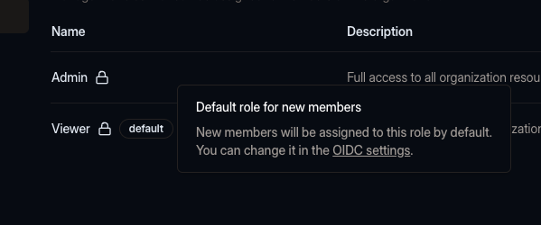

We're introducing **customizable default member roles for organizations** using OIDC authentication.

Previously, every new member signing in via OIDC was automatically assigned the `Viewer` role by
default. While this ensured a secure baseline, it often created unnecessary friction for admins.
Admins frequently had to manually assign roles for new members - an extra task that slowed down the
onboarding process.

With this update, we're giving you more control over how new members are assigned roles. You can now
configure a **default role** for OIDC users in your organization's settings. This role will be
applied automatically to every new member who signs in via OIDC.

### How to set a default role

The default role is set to `Viewer`, but you can change it in the OIDC configuration to any role
you've created.

1. Navigate to your organization’s settings.
2. Open the **OIDC** configuration.
3. Select the **Default Member Role** option to the role that best fits your team’s onboarding
   process.
4. No need to save - the changes are applied automatically.

Try it today and let us know what you think!
